# Common Data Service (CDS) 初探
> 作者：陈希章 发表于 2017年12月16日

## 前言

Common Data Service（以下简称为CDS），通用数据服务是一个创新性的基础功能，这是微软试图打造一个全新的基于SaaS模式的数据服务平台，一方面整合Office 365和Dynamics 365的数据（虽然现在还没有做到），与此同时，支撑以PowerApps，Microsoft Flow，Power BI为核心的商业应用服务。下面这个图可以清晰地看出它们之间的关系：

CDS最早是作为PowerApps的一部分进行开发的，所以到目前为止，CDS的管理界面都是集成在PowerApps中的，每个PowerApps的环境可以对应一个CDS数据库。

> CDS正式GA的时间是2016年10月份。请参考当时的官方文档：https://powerapps.microsoft.com/en-us/blog/powerapps-cds-ga/

除了数据库，CDS还有几个主要概念，分别如下

1. 实体（Entity）
1. 关系（Relationship）
1. 选项值（Picklist）

CDS定义了一套可以在不同的组织通用的实体，以及它们的关系。绝大部分情况下，你应该直接使用这些实体，而不需要创建自定义实体。

## 创建和管理数据库

要创建一个CDS数据库，你可以尝试登录 https://preview.admin.powerapps.com/environments ，先要创建一个Environment（环境）

成功创建环境后，会提示你是否要创建数据库

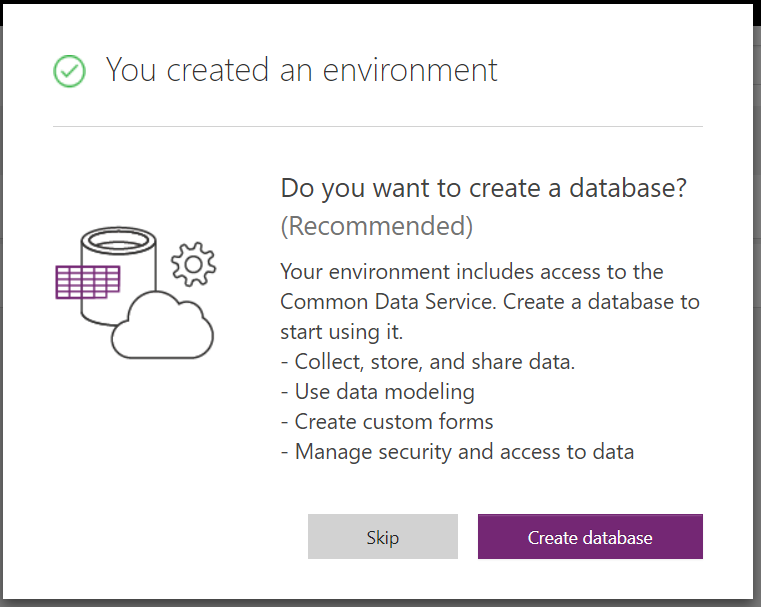

如果选择创建，则可以设置权限，然后稍等片刻即可完成数据库的创建

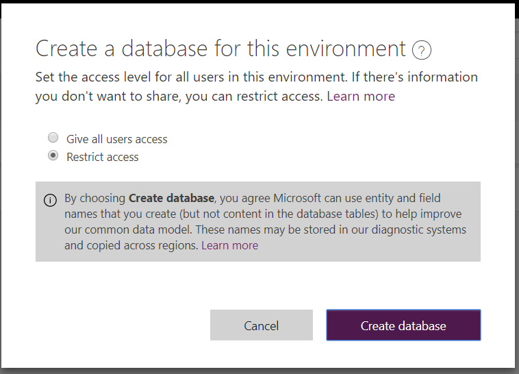

## 在Excel中编辑实体数据

对于广大的Excel用户来说，还有一个好消息就是，CDS的数据支持在Excel中直接支持。这在需要批量更新数据的时候，可能更加有用。你需要做的是，定位到你要编辑的实体，然后点击“Open in excel”按钮

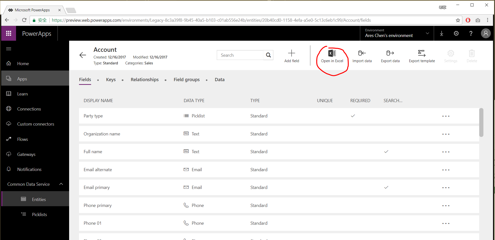

下载得到一个Excel文件，双击打开后，除了看到一个表格结构外，还会自动加载一个Office Add-in

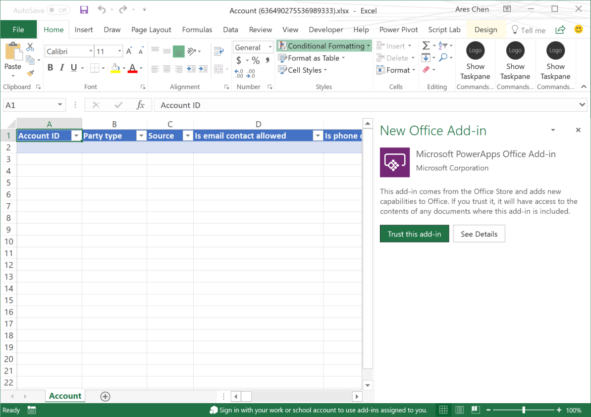

按照提示，Trust this add-in，然后在下一界面中输入你的Office 365账号和密码登录后，稍等片刻即可刷新读取到所有这个实体的数据

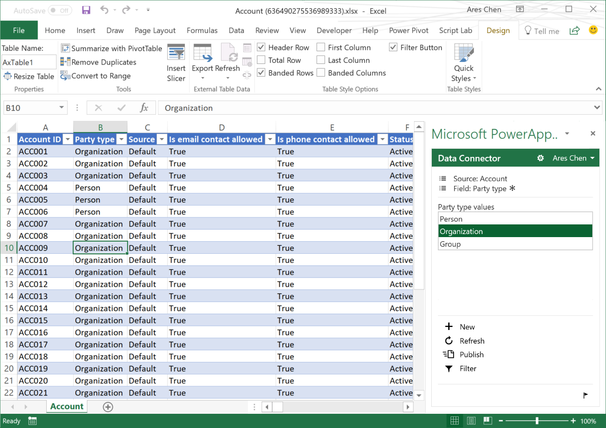

当选择某一列时，这个插件会自动检测到数据类型，如果是有选项值的话，还会自动列出来。这样的话，你可以在Excel中修改某个数据，然后点击“Publish”即可完成更新。

## 在Outlook中集成Common Data Service

除了Excel的集成，CDS还提供了一个与Outlook集成的工具，要启动该功能，需要在CDS的界面上点击“Productivity Settings”，然后按照提示下载一个清单文件

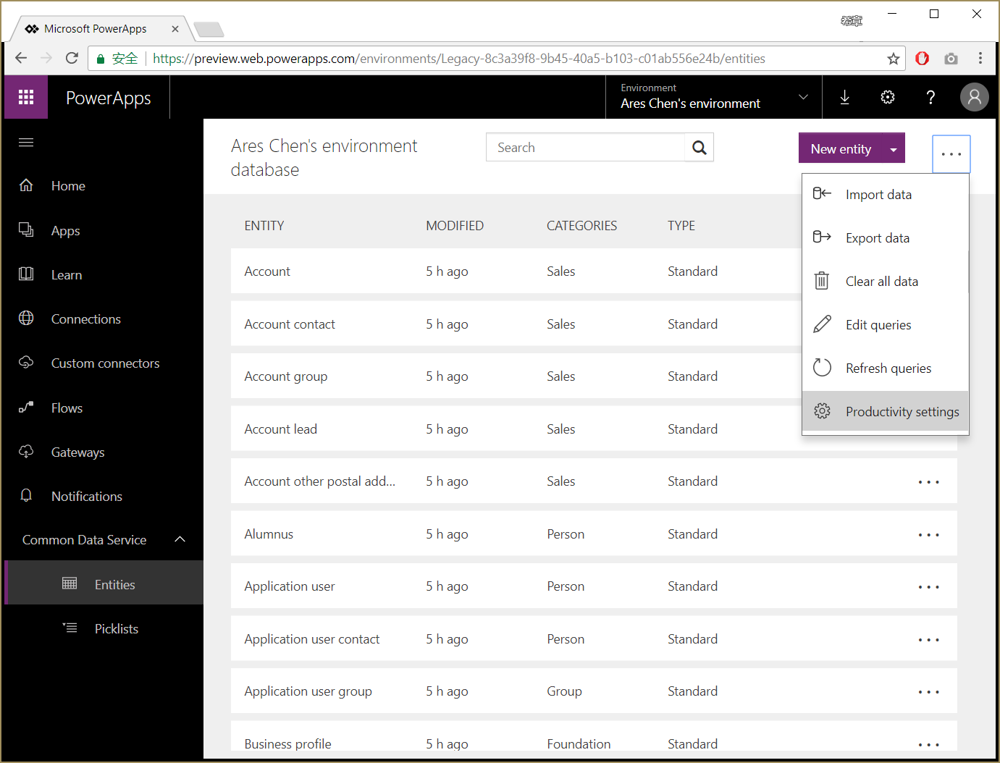

这将下载一个XML文件，其实是一个Outlook Add-in的清单文件（manifest）。接下来我们可以利用这个文件在Outlook中加载一个Add-in。

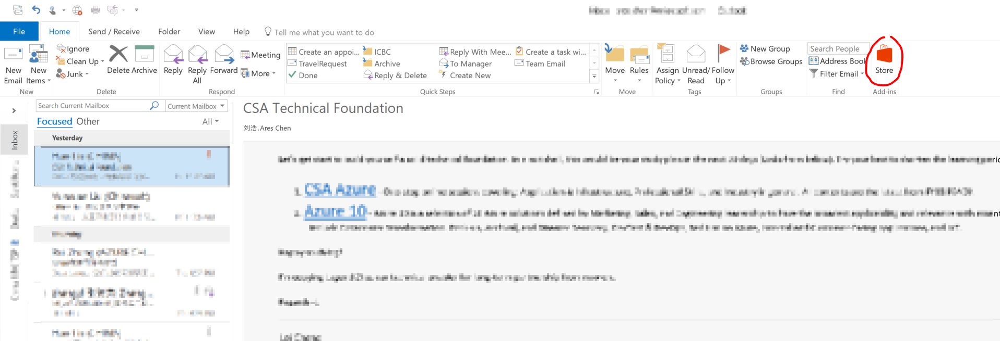

在Outlook的主界面上，点击“Store”这个按钮

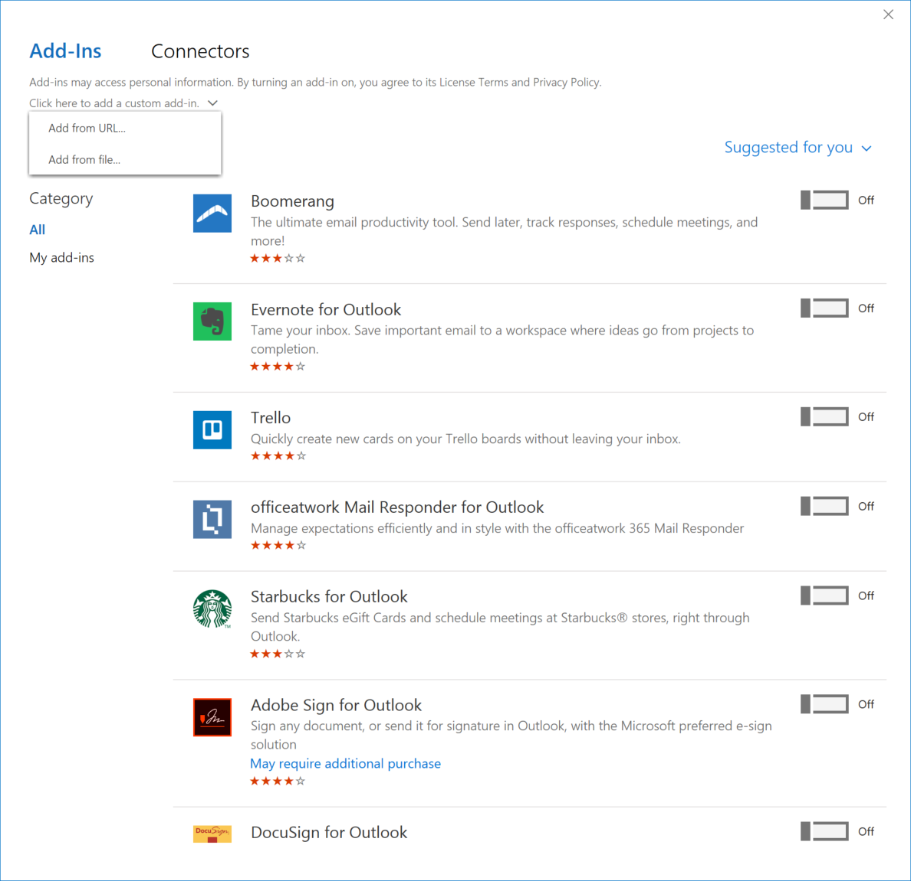

在Add-ins的界面，选择“Add from File...”

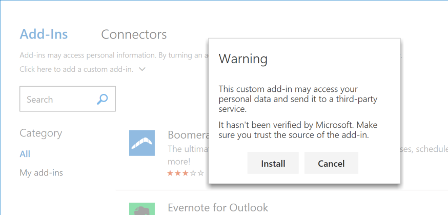

选择Install

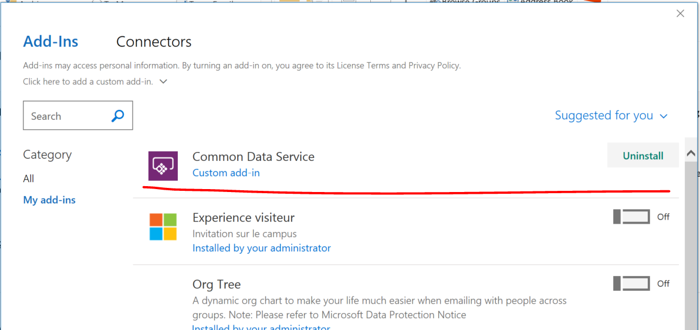

这个插件很有意思，你安装完之后，在Outlook主界面上面并看不到任何变化，它是对邮件窗口的一个扩展。目前我发现的功能是这样的：在任意一封邮件中，会多出来一个按钮“Common Data Service”的按钮，点击后，会展开一个面板，它会检测到这个邮件中涉及到联系人，然后去跟CDS中的Contact这个实体对比，如果不存在，则可以添加为Contact，如果存在，则会尝试查找该联系人相关的Case记录。例如下面这个例子

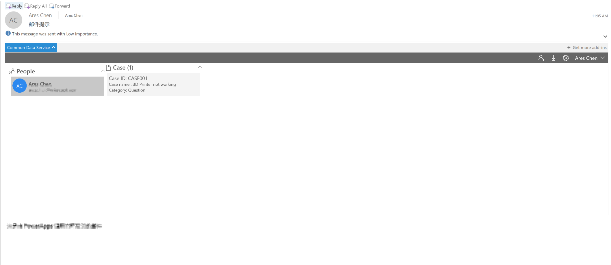

> 目前该插件是在Preview的阶段，仅开放极少数的实体整合，准确地说，只有Case这个实体可用。

## 在PowerApps中使用Common Data Service

我在文章开始已经提到了CDS与PowerApps的渊源，应该说PowerApps是跟CDS结合得最好的一个应用。对于PowerApps来说，CDS是一种更加好的数据源，在实体之间定义的关系能被自动识别出来，并且生成对应的下拉框。

Common Data Service是PowerApps中一个默认的连接器

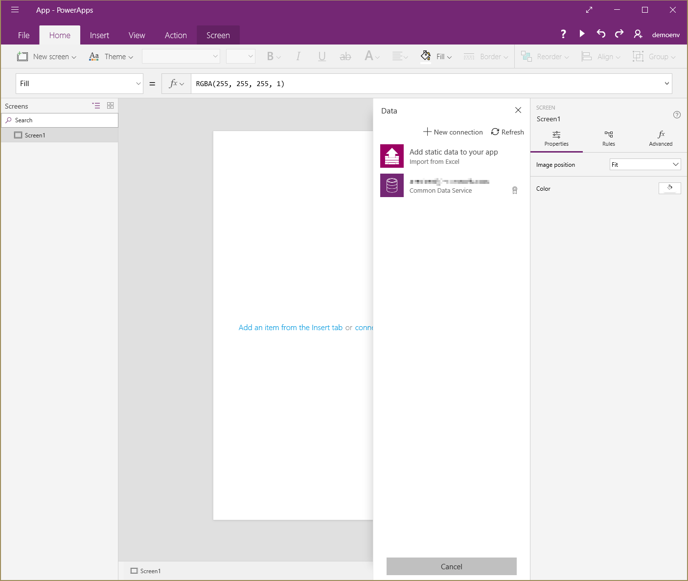

登录成功后，可以在实体列表中选择你希望在当前应用使用的实体

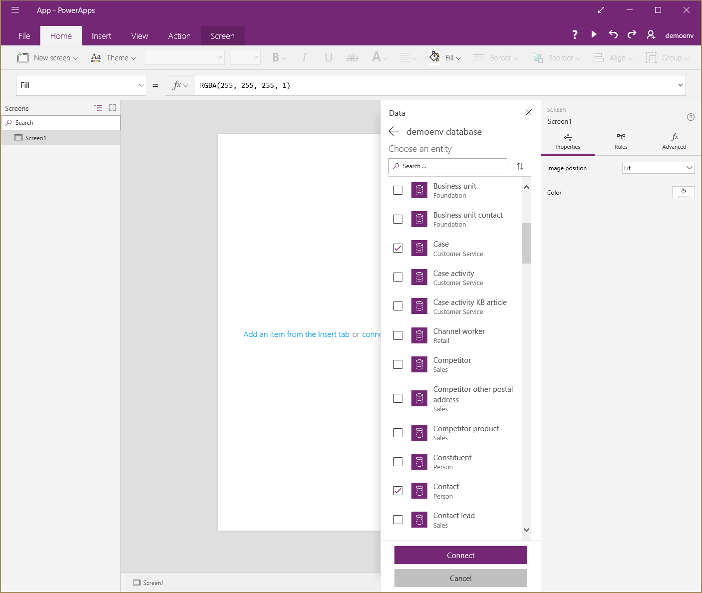

点击“Connect”后，接下来可以在界面上使用这些实体的数据，例如下面这个表单

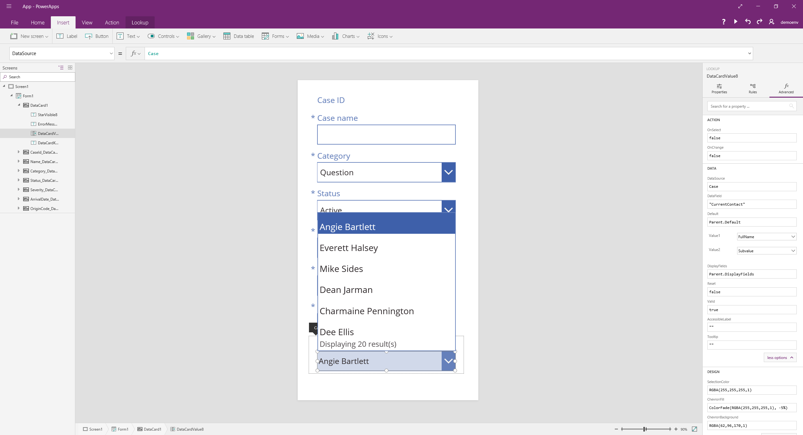

这里特别提一下CDS的优势，我选中的这个字段叫CurrentContact，它的类型其实是一个复杂类型（Contact），透过CDS，PowerApps其实知道这是要读取另外一个实体的信息，所以它会自动生成一个下拉框，而且可以自由设定要显示这个实体里面的什么属性。

至于更多的细节，这里就不展开了。如果大家对于PowerApps还不太熟悉，欢迎阅读下面两篇文章

1. [PowerApps 入门篇](powerapps.md)
1. [PowerApps 进阶篇](powerappsadv.md)

## 在Microsoft Flow 中使用Common Data Service

接下来要谈一下的是在Microsoft Flow中如何跟CDS进行集成和交互。你可以将CDS理解为一种数据源，那么在Microsoft Flow中，一方面可以根据CDS的数据变化触发流程（例如新增了一个Case时进行触发），也可以在其他流程中，往CDS的实体中写入数据。下图可以看到跟Common data service相关的模板就有18个。

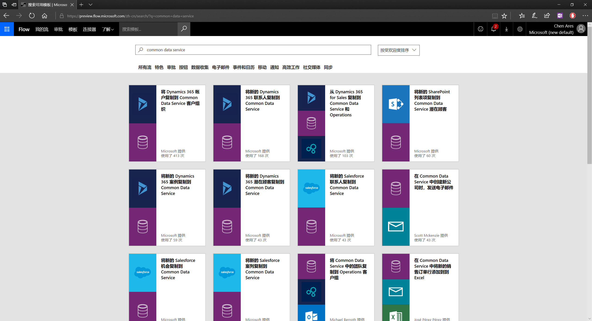

Common Data Service的触发器共有两个，可以监听新增记录和更新记录两个行为

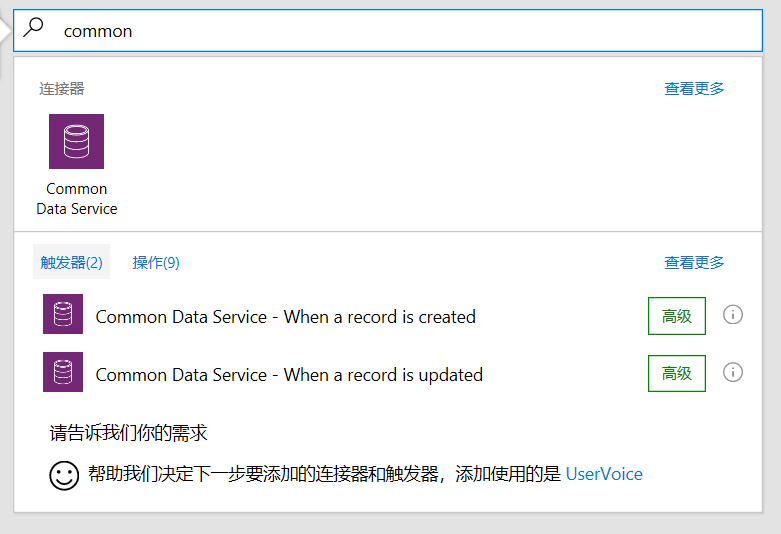

Common Data Service的操作共有九个

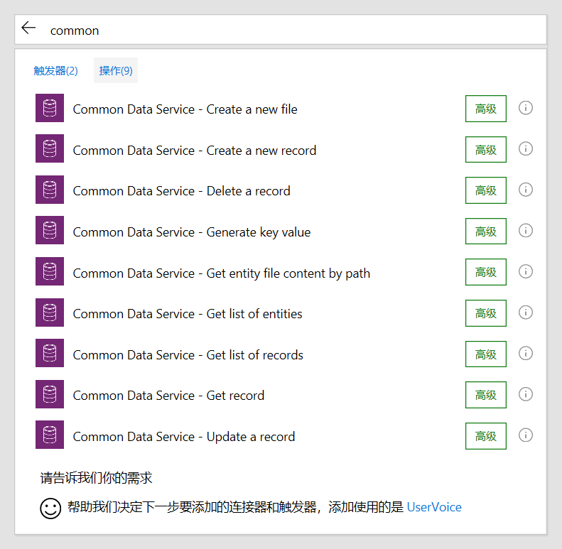

关于Microsoft Flow的细节，同样不是本文的重点，如果你还不太熟悉，欢迎阅读下面这篇文章

1. [Microsoft Flow 概览](microsoftflow.md)

## 在Power BI中使用Common Data Service

我们几乎可以断定，CDS将在日后的数据服务这个领域发挥重大作用，它整合Office 365和Dynamics 365的数据（虽然现在还没有做到），与此同时，支撑以PowerApps，Microsoft Flow，Power BI为核心的商业应用服务。有了这么多数据，接下来当然就是怎么利用它们，让它们发挥更大作用。这个时候，Power BI就是一个非常不错的选择。

讨论Power BI的细节，很明显超出了本文的范围，不过，我此前也写好了相关的文章，请参考  [观未见，行不止 —— Power BI 两周年技术和方案交流圆桌会议纪实](powerbi.md) 。

根据[二月份的官方说明](https://powerapps.microsoft.com/en-us/blog/cdsconnectortopowerbi/)，Common Data Service已经可以直接在Power BI中使用了，但目前只是Preview，而且仅限于美国用户才能使用。

我在自己的Power BI Desktop中其实是能看到这方面的界面，但实际无法操作，可能还是需要等一段时间吧。

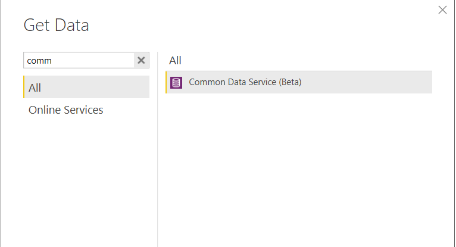

在数据源中搜索Common Data Service，然后点击下一步

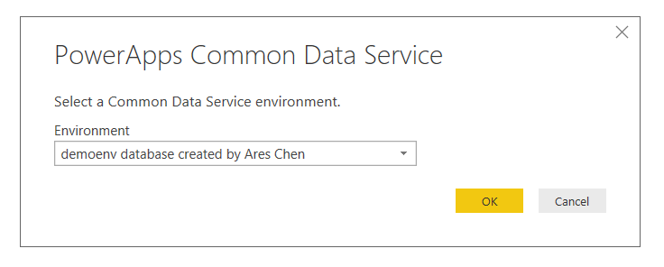

选择对应的数据库之后，点击Ok，很不幸，目前为止，你可能也会收到下面这个类似的提示

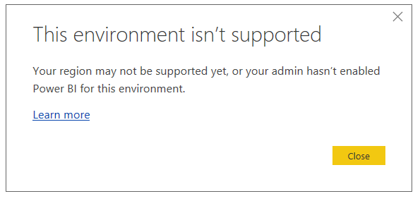

我检查过Admin Center，确实没有发现下图提到的那个“Enable”按钮，这可能是导致我无法使用的原因吧，目前来说，我们能做的估计只有等了。

## Common Data Service SDK

作为一个开发人员，我很自然还会想到，Common Data Service是否有开放的接口，可以让我自己开发的应用程序可以与之交互呢？答案是肯定的，这部分功能目前也只是在前期的研发中，但我相信它将成为CDS成功的关健。

下面这篇文章有基本的介绍，目前产品组提供了C# SDK的Sample，最好的情况是，他们正在跟Microsoft Graph团队合作，未来应该有望直接通过统一的接口就能访问到CDS，这真是太酷了！

https://docs.microsoft.com/en-us/common-data-service/entity-reference/cds-sdk-get-started