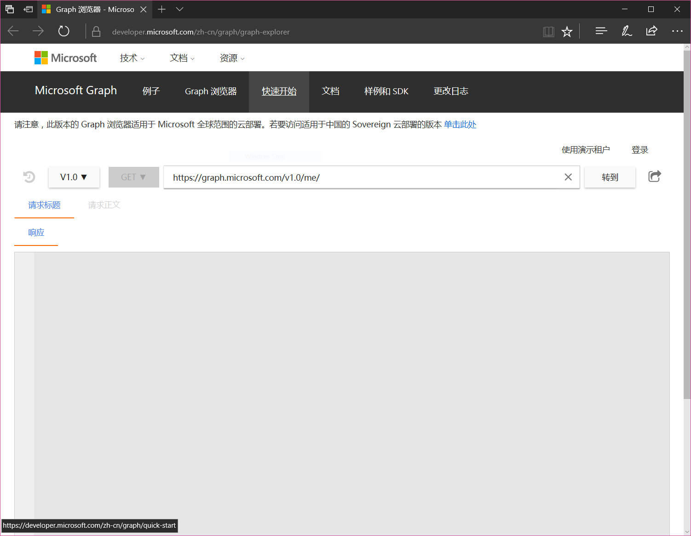
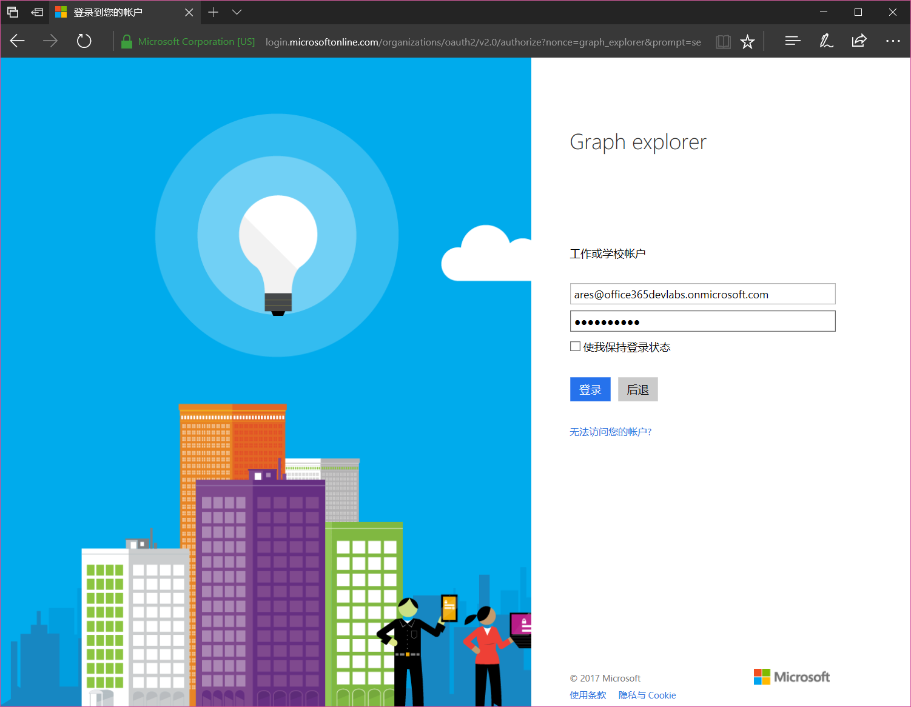
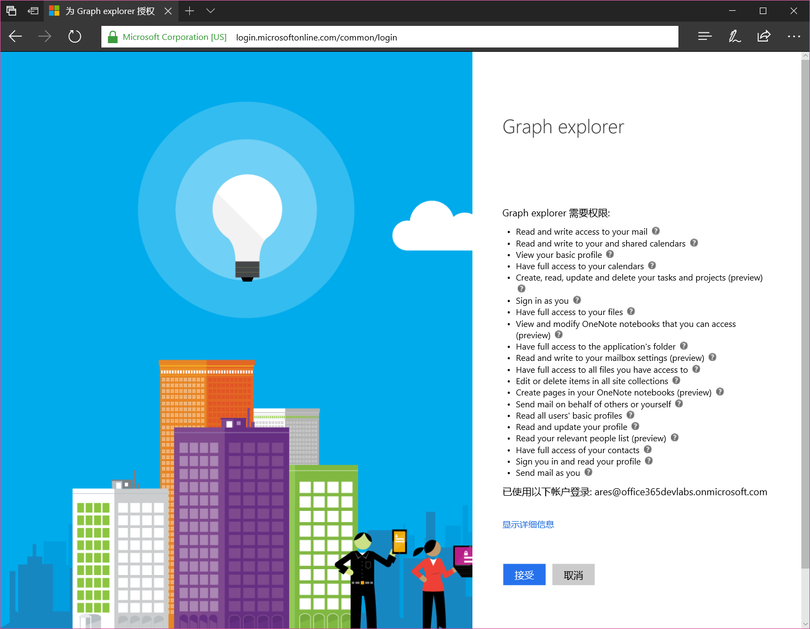
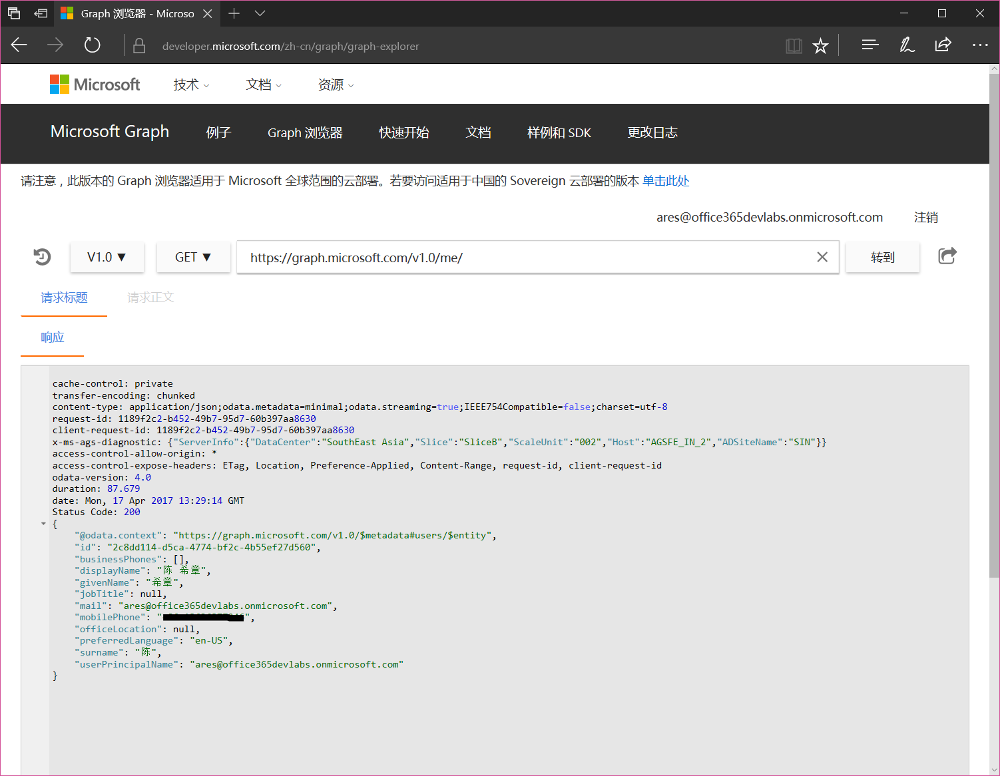
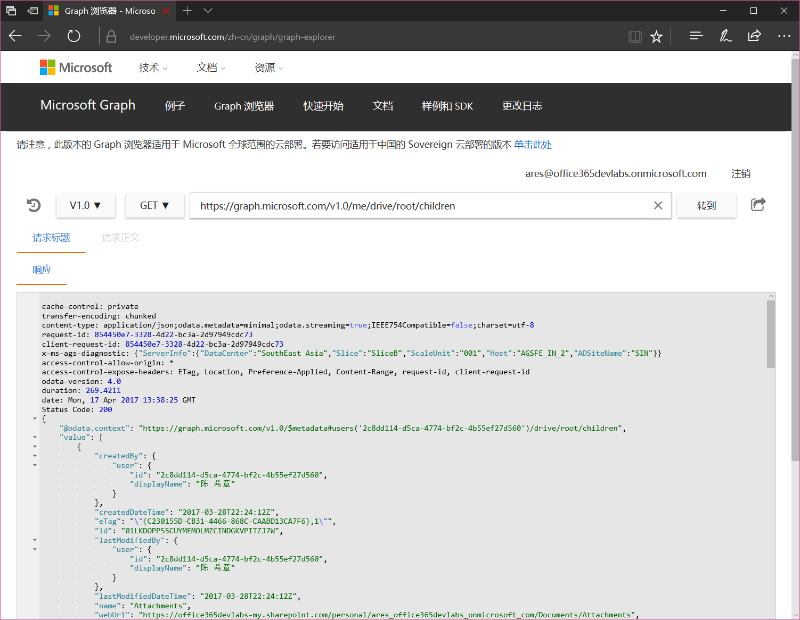
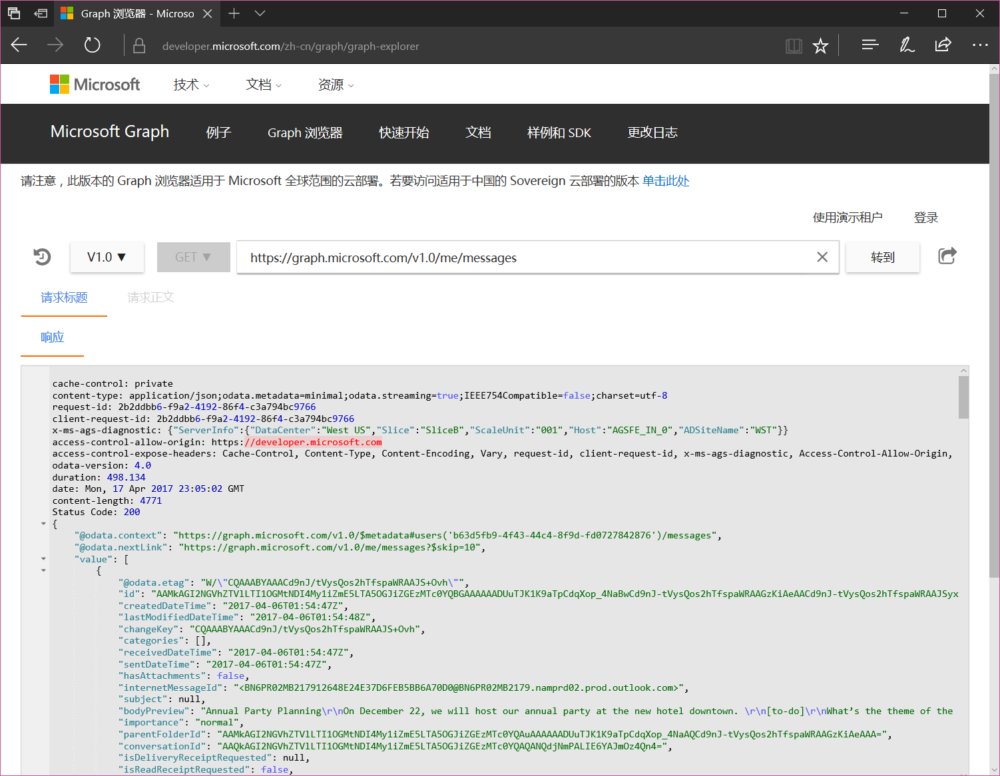
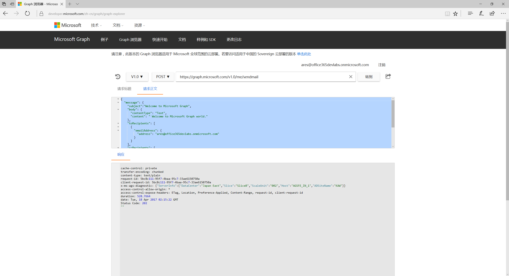
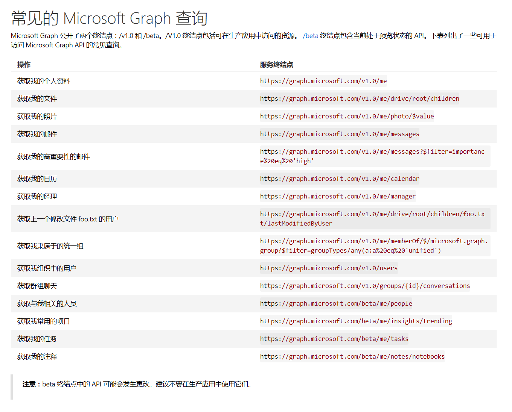

# 通过Graph 浏览器体验Microsoft Graph
> 作者：陈希章 发表于 2017年3月18日

[上一篇](microsoftgraphoverview.md)介绍了Microsoft Graph的基本概念，接下来我们快速体验一下Microsoft Graph到底能做什么？

为了帮助开发人员直观和快速体验Microsoft Graph的魅力，官方提供了一个专门的工具，叫做Graph 浏览器（Graph Explorer）。同时，由于国际版和世纪互联版本的Graph接口相关地址有所不同，所以针对这两个不同的版本，分别有对应的Graph浏览器。

1. 国际版Graph 浏览器: [https://developer.microsoft.com/zh-cn/graph/graph-explorer](https://developer.microsoft.com/zh-cn/graph/graph-explorer)
2. 世纪互联版 Graph 浏览器: [https://developer.microsoft.com/zh-cn/graph/graph-explorer-china](https://developer.microsoft.com/zh-cn/graph/graph-explorer-china)

> 本文将以国际版Graph 浏览器作为演示。两者的功能及使用流程基本类似，具体的差异在于世纪互联版的某些接口还在快速开发中。关于两者的细微差别，请随时可以通过[https://developer.microsoft.com/zh-cn/graph/docs/concepts/deployments](https://developer.microsoft.com/zh-cn/graph/docs/concepts/deployments) 进行了解。

下面将简单演示五个场景，帮助大家理解Microsoft Graph API及其工作原理。

## 登录Graph 浏览器


点击上图中的“登录”按钮，使用国际版Office 365账号进行登录。请注意，我在此前的[文章](office365devenv.md)中已经介绍了如何申请一个为期一年的Office 365开发者订阅。



输入正确的账号和密码后，点击确定，系统将引导用户进行授权确认，如下图所示



只有你自己点击了“接受”按钮，Graph 浏览器才能真正访问到你的数据。上面这个授权方式，其实就是所谓的OAuth的标准机制：Graph 浏览器作为一个独立的应用，它并不需要保存你的Office 365账号信息，它可以得到用户授权之后代表用户去访问到Graph后台所连接的资源，包括Office 365的数据。


## 查询当前用户的基本信息

完成授权登录后，我们就可以愉快地使用Microsoft Graph的服务了。首先，下图示例了如何获取当前用户的基本信息。


Microsoft Graph的服务是RESTful的，具体表现在发起服务请求，只需要一个Url即可（本例为https://graph.microsoft.com/v1.0/me/），使用的方式也是标准的Http方法（GET,POST等），与此同时，它的返回结果是业界应用最广的Json格式。

## 查询当前用户的个人网盘文件列表
通过 https://graph.microsoft.com/v1.0/me/drive/root/children ，点击“转到”，可以查询当前用户的个人网盘（OneDrive for Business)文件列表。




## 查询当前用户的收件箱前10条邮件信息
使用Microsoft Graph，在得到用户授权的前提下，应用程序可以读取到用户的邮件列表，所使用的服务请求地址是 https://graph.microsoft.com/v1.0/me/messages 



默认情况下，这个查询只会返回前10条邮件信息，并且不区分邮件目录，如果需要获取特定邮箱目录的邮件信息，请参考下面这样的语法

https://graph.microsoft.com/v1.0/me/mailFolders/**inbox**/messages

如果想要对返回结果集做筛选，排序，请参考下面这样的语法
1. 只选择前五封邮件  https://graph.microsoft.com/v1.0/me/messages?$top=5
2. 跳过前五封邮件选择十封邮件 https://graph.microsoft.com/v1.0/me/messages?$skip=5&take=10
3. 按照发件人邮件地址排序 https://graph.microsoft.com/v1.0/me/messages?$orderby=from/emailAddress/address

> 更多查询参数，请参考[https://developer.microsoft.com/zh-cn/graph/docs/overview/query_parameters](https://developer.microsoft.com/zh-cn/graph/docs/overview/query_parameters)

## 发送邮件

上面演示了几个场景都是查询，实际上Microsoft Graph的功能远远不止是做查询，它也可以在用户授权下进行某些操作，例如接下来要演示的发送邮件。

这里需要用到的API是https://graph.microsoft.com/v1.0/me/sendmail，这个接口需要使用POST方法调用，你要发送的邮件内容通过Json格式进行定义。

```
{
  "message": {
    "subject":"Welcome to Microsoft Graph",
    "body": {
      "contentType": "Text",
      "content": " Welcome to Microsoft Graph world."
    },
    "toRecipients": [
      {
        "emailAddress": {
          "address": "ares@office365devlabs.onmicrosoft.com"
        }
      }
    ],
    "ccRecipients": [
      {
        "emailAddress": {
          "address": "ares@xizhang.com"
        }
      }
    ]
  },
  "saveToSentItems": "true"
}

```



如果发送成功的话，返回状态码为200，反之，则会有详细的错误信息。

## 结语
本文我介绍了利用Graph 浏览器快速体验Microsoft Graph的强大功能。以上只是举了几个常见的例子，如何用支持的功能很多，等待你的发现，常见的查询请参考下图



