# Microsoft Flow 概览
> 作者：陈希章 发表于 2017年12月15日

## 前言

纵观一下我们周围的世界，以及我们每天忙忙碌碌的工作，你会“惊奇地”发现它们都是一个事件接着一个事件发生的。例如，我每天早上起来，一打开亲爱的手机，就会收到一封邮件，告诉我说今天9点要交个材料，然后11点又有个con-call，下午可能还要拜访一个客户之类的。每一天，每一周几乎都是如此，就连每个月也总有那么几次 —— 要交各种费用，还各种卡的额度。我并不是说我有多忙（这不重要），我只是说，我们很多时候以为有能力控制生活变成我们想要的样子，但事实上，我们大部分时候是在响应一个一个的事件 —— 换言之，我们其实在一个一个流程里面。

所以，人、物、事件和流程，构成了精彩纷呈的世界，但我不准备就这个高大上的话题扯太远了。我们今天要谈的是，在IT的世界里面，我们怎么样把各种奇形怪状的应用系统，各种事件和流程无缝地整合起来，并且让它能更好地帮助人们又好又快地完成工作。

这不是一个新话题了。在近二十年以来，有大量的工作流引擎（Workflow Engine），BPM 或 EDI 系统不断涌现，在企业级市场上也曾风起云涌，各领风骚。不过，随着云和移动互联网时代的到来，它们或多或少都受到一些挑战和冲击。在这一波新的浪潮中，ifttt无疑是站在浪尖的那一个，风头一时无两。ifttt = if this, then that，很好地诠释了它的精髓。

微软在企业级领域有Biztalk这样的BPM服务器，也有Workflow Foundation这样的系统层面的工作流能力，在SharePoint Server中内置了Workflow Foundation的支持。与此同时在云平台蓬勃发展的当下，又重新开发和打造了一个全新的流程平台，并且冠名为Microsoft Flow，它既有类似于ifttt的强大和灵活架构，也继承了微软多年的企业级服务的基因，在团队协作、与企业内部应用集成以及安全性等方面有一些自己的特点。

> 在微软的产品命名传统中，能直接冠以Microsoft作为名称一部分的，其实是不太多的，由此可见，Microsoft Flow 的价值和地位。

如果你有Office 365或者Dynamics 365的账号，你或许已经拥有了Microsoft Flow，你当然也可以自行申请免费版（注意，是真正免费，不是试用版）和收费版本，详情请参考： <https://flow.microsoft.com/en-us/pricing/>

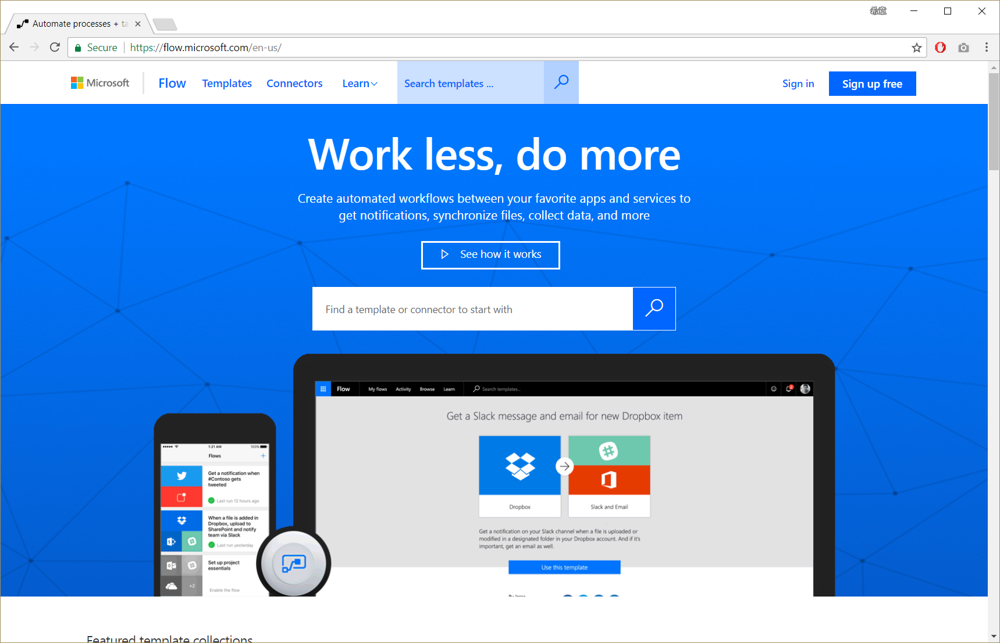

本文将包括如下内容，我相信会对大家了解Microsoft Flow 会有帮助：

1. 通过Microsoft Flow实现特定邮件的附件自动保存到SharePoint Online文档库中
1. 实现周期性执行的流程
1. 实现用户手工启动的流程
1. 在 PowerApps 里面操作引发的流程
1. 通过 Power BI 警报引发的流程

## 通过Microsoft Flow实现特定邮件的附件自动保存到SharePoint Online文档库中

这种基于事件的流程处理，可能是Microsoft Flow中最为常见的。这是我们部门在用的一个真实案例，我大致介绍一下场景：我们每周会收到内部同事发送过来的一个邮件，通常都带有一个附件（名称是 Office 365 周报.xlsx）。与此同时，我们又希望这些附件，能以固定命名规则保存在团队网站的某个文档库中，这样我们所有人就随时可以集中看到所有的周报。我们希望这个动作能自动实现，无需人为地操作。

从Microsoft Flow的角度来看，这样的流程简直是太合它的胃口了，你甚至都可以直接用它的模板实现。请登陆到 flow.microsoft.com 后，搜索“附件”这个关键字，你可以看到有好多的模板列出来：

我们要的其实就是第一排的第三个模板

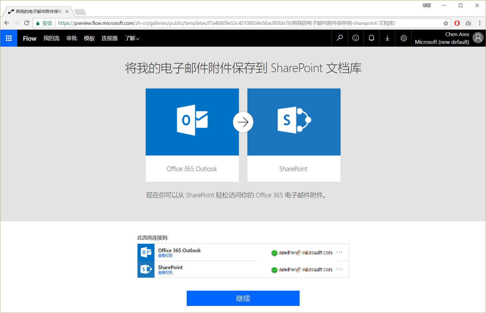

设置好你的账号信息，然后点击“继续”按钮，设置一下你需要监控的邮箱文件夹，以及要保存的SharePoint Online团队网站以及文档库位置。

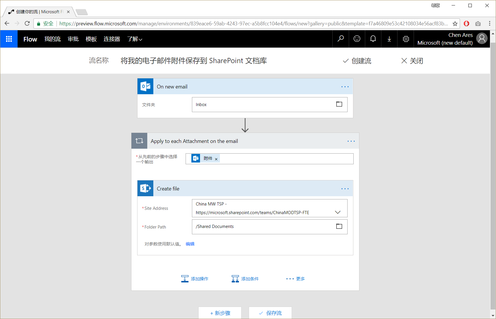

等一等，我们如何去设置条件呢？毕竟我们只是想监控带有附件，而且附件名为“Office 365 周报.xlsx”这样的邮件呢。通过点击下面的加号，选择“添加条件”即可实现这个功能

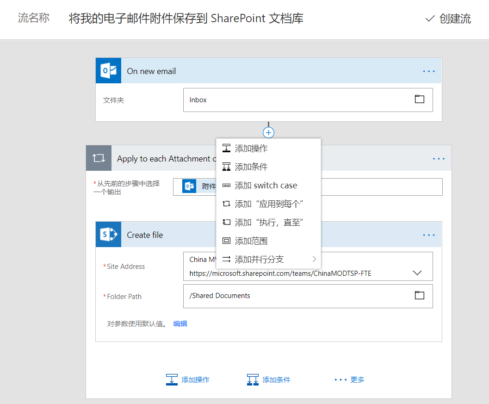

下面是我编辑好的一个流程，带有两个条件分支，只有两个条件都满足的话，我才会在SharePoint Online 相应的文档库创建文件，而且文件名是自动加上了时间戳的，这样确保不会重复（默认情况下，如果文件名重复的话，Microsoft Flow会自动覆盖掉原文件）

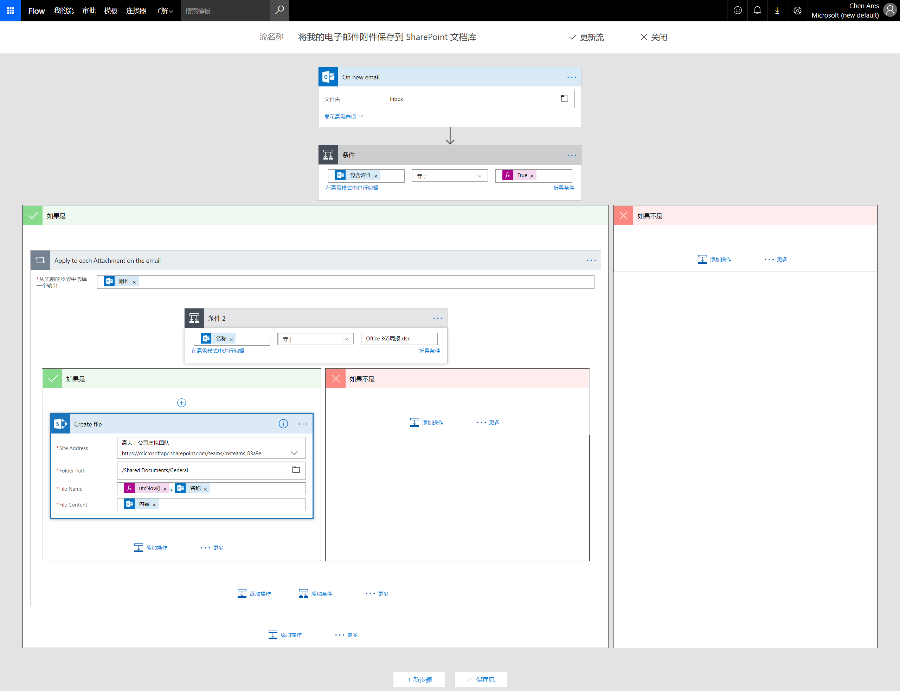

保存这个工作流，然后模拟发送一个邮件，我很快就能看到SharePoint Online的文档库中已经自动创建了一个文件

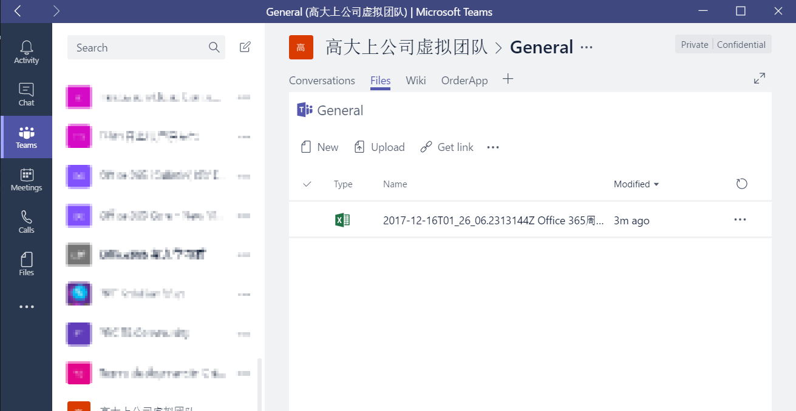

如果你对这个流程的执行细节有兴趣，可以回到工作流的视图查看运行记录

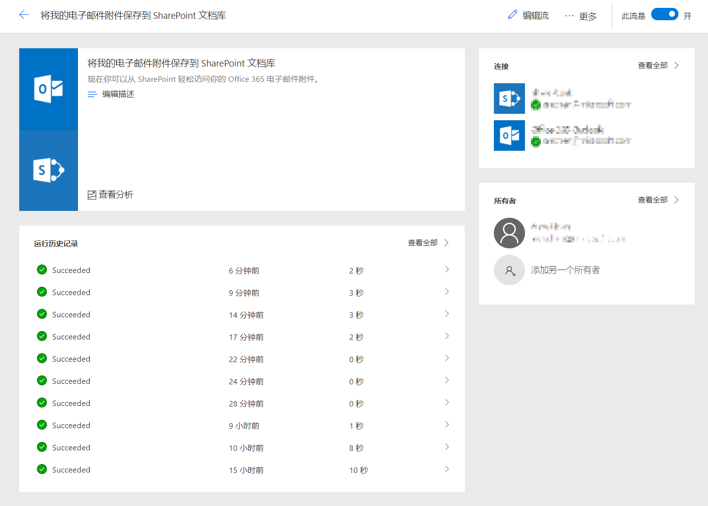

点击某一个运行记录，可以看到细节

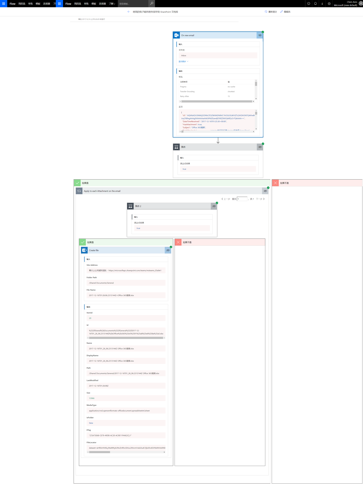

> 如果某次执行失败，你将收到一封邮件，而且可以在这个界面重新提交流程执行。

到这里为止，我们已经创建了一个简单但实用的流程，它会自动监控我的邮箱的收件箱，如果邮件带有附件，并且附件名是“Office 365周报.xls”的话，就将此文件加上时间戳保存到我指定的SharePoint Online文档库中去。如果你觉得这个想法还不错，你还可以分享给其他同事使用呢。

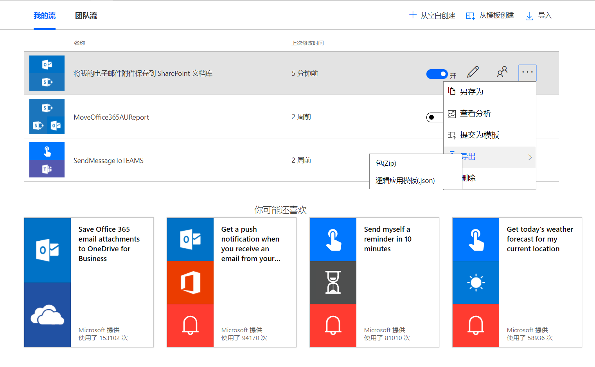

对于复杂一些的流程，Microsoft Flow支持多人共同编辑

## 周期性执行的流程

上面这种场景是根据某个事件来触发Microsoft Flow，这当然是最常见的，但还有一种情况也比较普遍，那就是周期性执行某个流程，例如每个月从SharePoint Online的列表中导出一批数据，生成一个Excel文件，然后发送给某个邮箱。这样要怎么实现的呢？流程的细节我这里不准备展开，但我要提示的是最关健的一个操作，就是如何设置周期性执行流程。

其实并不难，你只需要将一个特定的触发器放在流程的第一步就可以了。

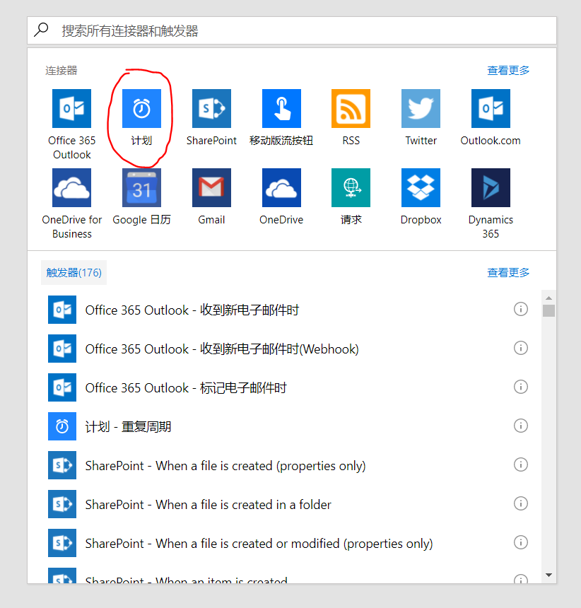

选择“计划”这个触发器，进行必要的设置

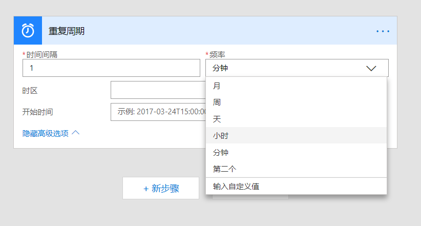

## 用户手工启动的流程

Microsoft Flow是如此的简单易用，以至于我们不再满足于将其定义为仅仅在后台执行自动化任务（就像上面提到的两种情况一样），有没有可能定义一个流程，然后由我们自己想什么时候执行就什么时候执行呢？打个比方说，电脑开机其实就是一个流程，但我不想它每次都自动开机，而是由我按下开机按钮后才开机。

我很喜欢上面这个比喻，毕竟这样一来，作为人类我们似乎也多少能找回了一些控制世界的尊严和自豪感。不管怎样，Microsoft Flow确实实现了类似的机制，而且名称就叫“按钮”。

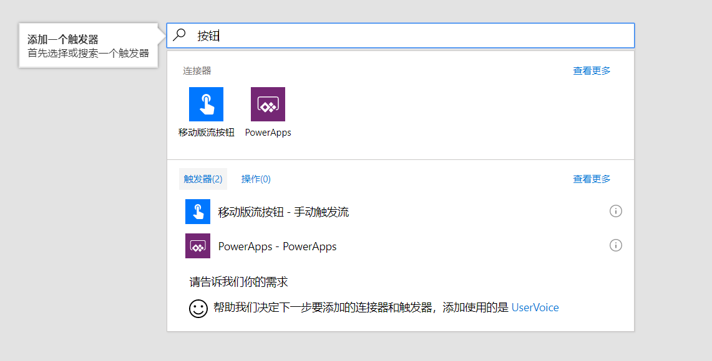

我们先来看第一种，它允许用户在Microsoft Flow的移动App中，通过一个按钮执行某个流程。例如我简单设计一个流程，让用户输入几个参数后，Microsoft Flow给我的邮箱发一个邮件。

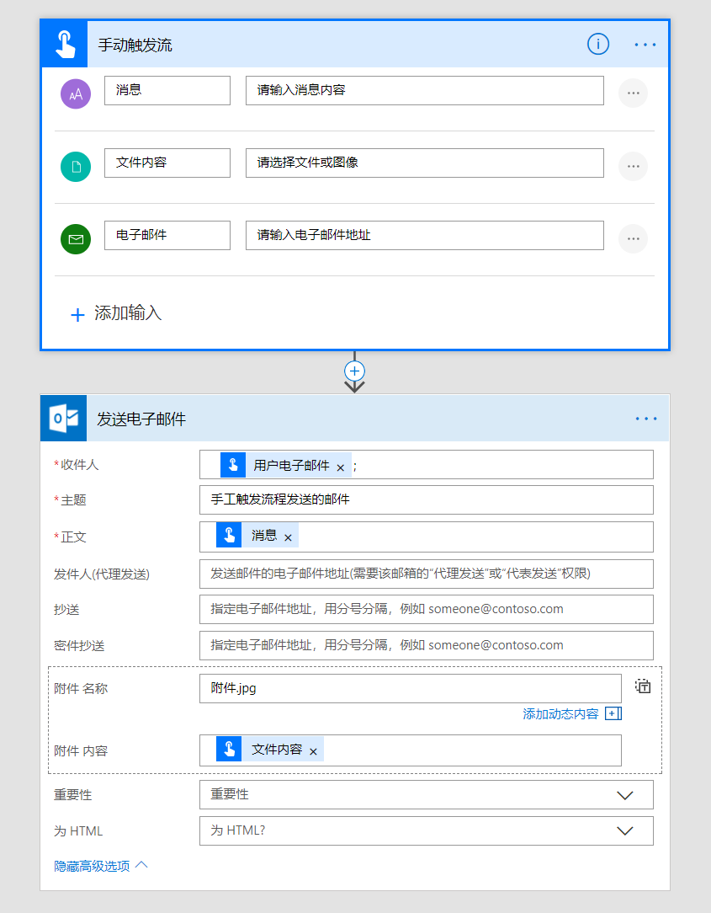

在Microsoft Flow的移动App里面，有一个专门的分类：Buttons

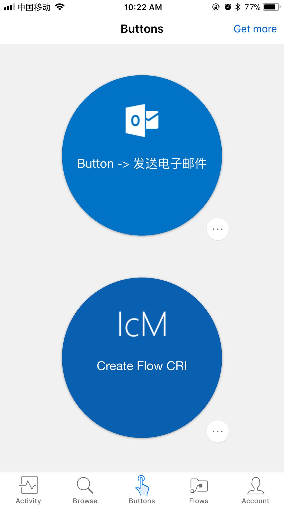

点击第一个按钮，会进入一个输入参数的界面

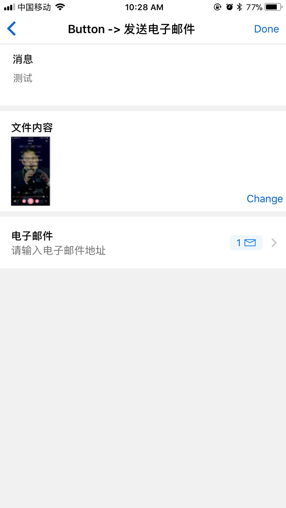

挺有意思的对吧？试想一下，你可以通过一个按钮发邮件，当然也可以通过它来开启你家里的空调。为什么不呢？

> 截至目前为止，Microsoft Flow的移动App，还只是在测试版，除了微软员工可以使用dog food版本以及部分App Store可以下载外，中国用户还不能下载。详情请关注：[下载地址](https://preview.flow.microsoft.com/en-us/mobile/download/?src=banner)

## 在PowerApps里面操作引发的流程

在上一个场景中，包括我在 [PowerApps 进阶篇](powerappsadv.md) 中我都提到了PowerApps可以和Flow结合起来实现强大的功能，到底怎么做的呢？这里我将揭晓谜底。

首先，PowerApps的应用提交的数据，也许是保存在Excel文件中，或者SharePoint Online的列表中。它只管那样做就好了。Flow 这边能监控Excel或者列表的变化，然后自动地在后台执行任务。这种情况下，PowerApps和Flow其实是松耦合的，没有任何直接联系的，这可能是最好的一种方式吧。

但是，我们确实能实现在PowerApps中直接发起Flow的流程。这个要分两步来走：

第一，创建一个可以从PowerApps中调用的流程。这里的关键是触发器是“PowerApps”，其他部分没有什么特别需要注意的。

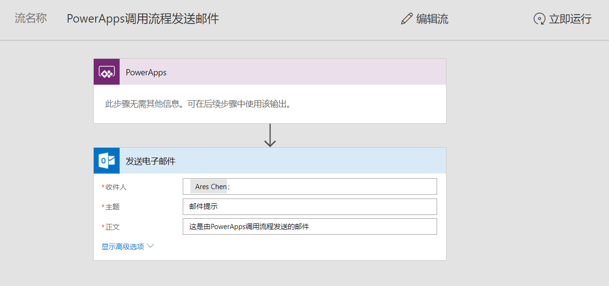

第二，在PowerApps的应用中启动流程。其实很简单，放一个按钮，然后在Action中选择“Flow”，此时会弹出一个面板，让你选择一个流程。

如果我们需要输入参数怎么办呢？这里有一个非常有意思的设计，是在Flow的设计器中，你可以选择一个你希望接受参数的位置，然后选择“在PowerApps中提问”，这样它就会生成一个上下文变量出来，如下图所示

然后，在PowerApps中，执行Run这个方法的时候，就可以指定邮件主题了。你肯定已经猜到了，这个参数可以定义任意多个，这真是太强大了。

## 通过Power BI 警报引发的流程

本文的最后我还要介绍一下如何在PowerBI中集成Flow来实现自动化。Power BI是新一代的智能数据分析和可视化的工具，一经发布就受到了广泛的关注和好评，目前稳居Gartner魔力象限的领导者象限。下图是一个典型的Power BI 仪表盘，用来分析零售门店的业绩。

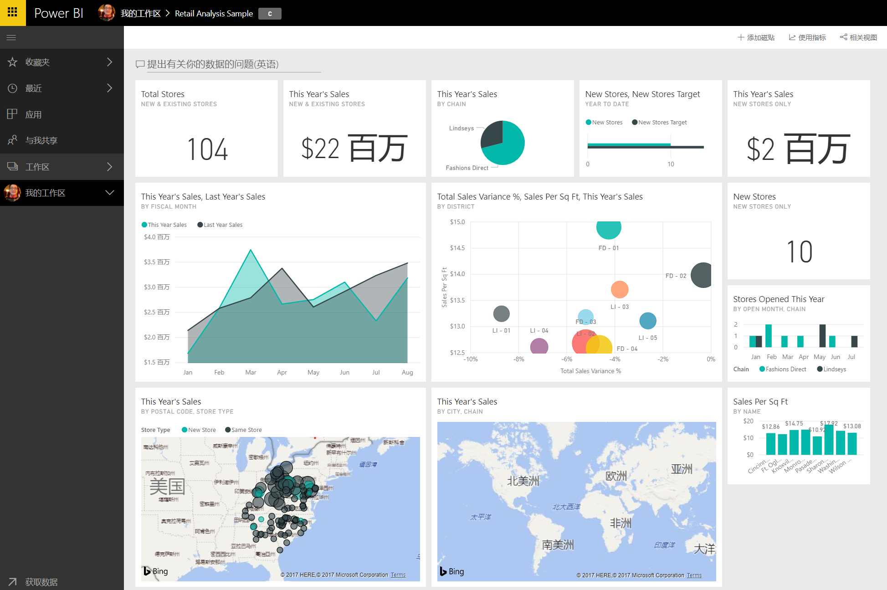

今天不会对于Power BI的细节进行展开，我只提一个很有意思的功能：假设我是一个销售总监，我希望能监控到这个仪表盘上面的一些关健指标，当它们发生变化，尤其是我不希望看到的一些变化（例如销售额下降明显）时，我能自动得到一些通知，我该怎么办呢？我是24小时不吃不睡地守在电脑前面刷这个仪表盘吗？当然不能，Power BI提供了一个警报的功能，可以让用户自己定义需要监控的指标，并且定义发除警报的动作，默认情况下，它可以给用户发一封邮件。创建警报很简单，在某个磁贴的右上角点击，会出现一个菜单。

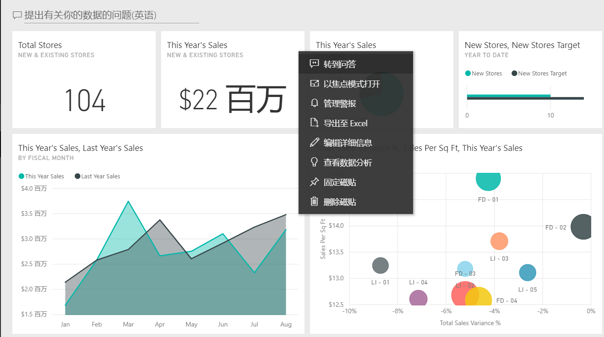

点击“管理警报”，然后点击“添加警报规则”

细心的你估计已经发现，在这个界面的右下方，其实有一个链接：“使用 Microsoft Flow 触发其他操作”，点击之后会调到Microsoft Flow的界面，并自动选择好了一个模板，你要做的就是设置一些账号即可。

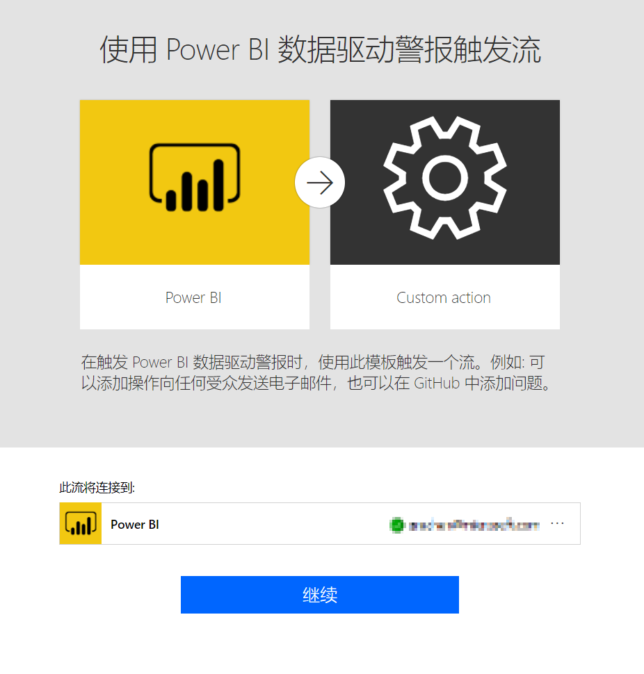

接下来你就可以发挥想象力定制这个流程吧，只要你愿意，你可以做的很复杂。不过，作为一个销售总监，你的成功之道可能是要赶紧去跑到门店现场去了解情况，所以关于这里面的更多的技术细节我就不多跟你展开了吧。

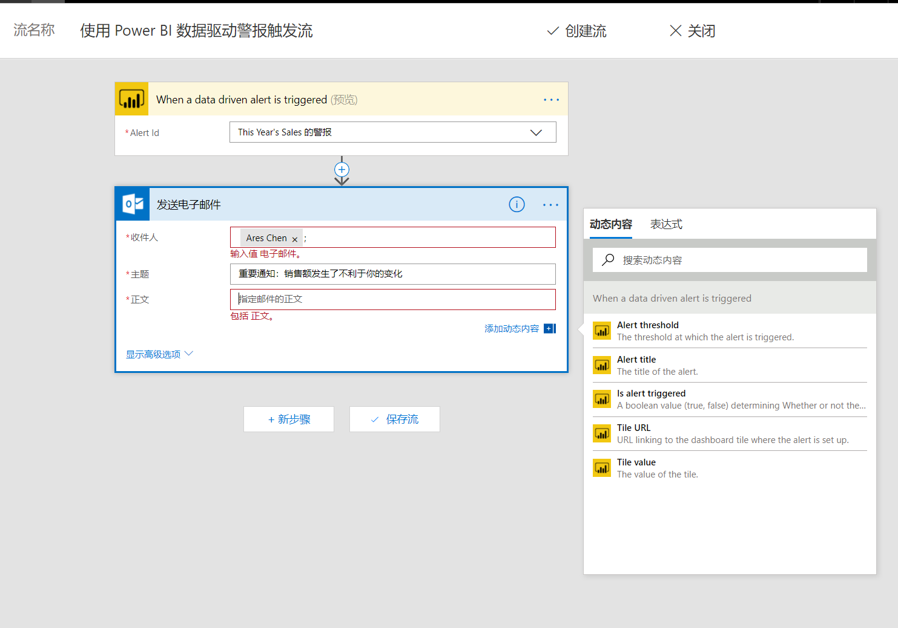