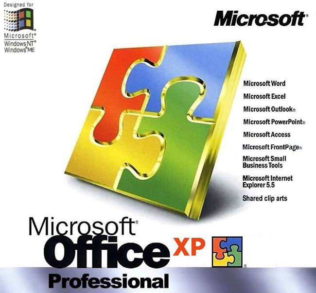
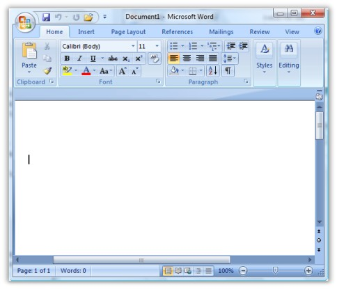
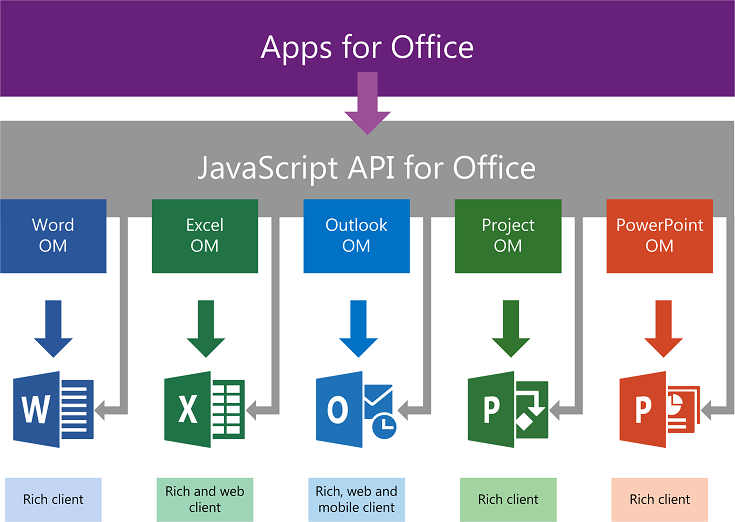
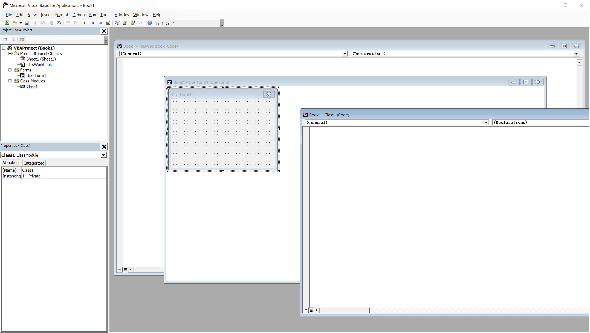
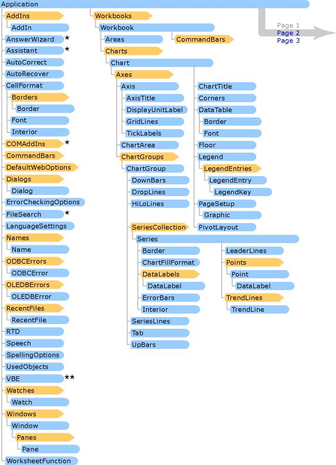
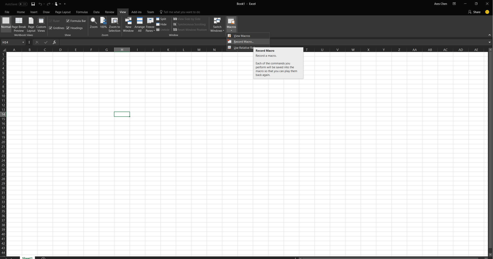
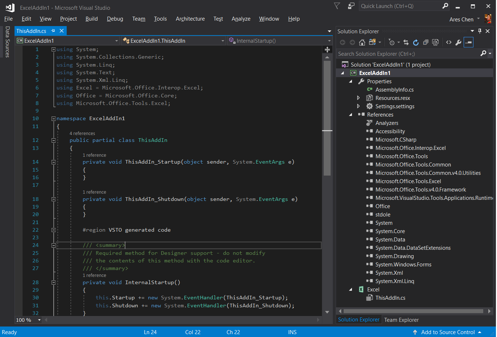

# Office 365开发概述及生态环境介绍（一）
> 原文于2017年3月13日首发于LinkedIn，请参考[这个链接](http://www.linkedin.com/pulse/office-365%E5%BC%80%E5%8F%91%E6%A6%82%E8%BF%B0%E5%8F%8A%E7%94%9F%E6%80%81%E7%8E%AF%E5%A2%83%E4%BB%8B%E7%BB%8D%E4%B8%80-%E5%B8%8C%E7%AB%A0-%E9%99%88)

离上一篇文章，很快又过去了两星期的时间。今天抓紧晚上的时间，开始了Office 365开发系列文章的第一篇，我会帮助大家回顾一下过去Office开发的一些场景，目前提供的一些能力，最后展望一下生态环境建设和未来的发展。

> 关于Office 365开发，这里的定义并不是指开发Office 365平台，或者接口（这两部分由微软数以万计的研发工程师们在负责），而是基于Office 365平台及其提供的接口，独立开发商（ISV）或者有一定能力的开发人员、高级用户针对Office 365的定制、扩展、集成等方面的开发。

## 回顾过去Office开发的基本情况

对于Office开发，我应该算起来是接触比较早的一批中国用户之一，所以如果大家愿意听，我很乐意分享一些Office开发的基本情况以供参考。

从Office 97开始，我使用过后面几乎所有的Office 版本，但是印象最深刻的有几个版本

### 1.Office XP

这个版本没有用年份来编号（实际上应该是Office 2002），原因估计是为了配合Windows XP的整体市场宣传定位。它的特殊之处在于有一个所谓的开发版（2000也有开发版，但在2002这个版本更加完善），有怀旧情结的同学，请移步这里进行围观。值得一提的是，虽然同样带有XP的光环，但Office XP远没有Windows XP那么风光（服役超过13年，甚至直到现在都还有用户对其念念不舍），因为它很快就被Office 2003取代了。

### 2. Office 2003

这是一个非常重要的版本，它代表中Office产品技术的一个巅峰时代——这个版本的Office功能非常强大，可以说是无所不包。我敢大胆地推测，正在看这篇文章的读者中绝大部分的朋友都用过这个版本吧。如果说Office XP是我用得比较全的一个版本（除了Outlook没有怎么用，其他组件基本都对照帮助文档摸了一遍，还用FrontPage做出了人生第一个奇丑无比的网站，但其实对那些所谓的开发完全是一知半解，半生不熟），那么Office 2003是我真正意义上开始较为深入使用的版本，尤其以Excel和Access这两个组件，结合当时的实际工作需要，我使用VBA开发了从简单到复杂的各种小应用。

学习Excel的VBA，我是完全认真的，一个佐证就是我在那个年月愿意花五十美金托人从国外辗转买来下面这样一本足有1000多页的书过来啃，而师从Mr.Spreadsheet——John Walkenbach，也算系出名门了。这本书以及John本人对我影响之大，很难用一两句讲清楚——在那个相对单纯的年代，我一头扎进Excel VBA的世界里，收获的可不仅仅是写代码带来的乐趣，还有在微软技术社区（那会儿叫新闻组）中认识的一大批朋友。事到如今，如果说我有什么遗憾的话，一是还没有见过John的真人，另外一个就是我虽然有心想把这本书传承给一位有缘人，但一直没有找到——它太厚了。

### 3.Office 2007

前面提到Office 2003是一个巅峰之作，那么Office 2007毫无疑问就是一个转型精品。表面上看，2007带来了全新的UI风格——Ribbon，这是一次大胆地尝试，因为谁都知道2003的菜单已经非常多了，以至于对于不少新手来说，经常发生找不到功能所在的位置。这种界面的创新带有一定的冒险（颠覆自己成熟的产品确实需要勇气），但事实证明是非常成功的。

除了界面上看到的变化，其实Office 2007的另外一个重要创新，是重新定义Office文档的格式——除了继续支持Office 2003及早期版本的二进制文件格式之外，还有一种全新的基于XML的文件格式（通常在默认的文件扩展名后面添加一个x以示区分，如Word 2003的格式是doc，而Word 2007虽然依然支持doc，但更推荐用户使用docx文件格式）。这个后来被正式命名为OpenXML的技术，微软在经过实践后将其贡献给ECMA，并被ISO和IEC等组织认定为开发文档格式的国际标准。如果对OpenXML的标准感兴趣，请参考 https://en.wikipedia.org/wiki/Office_Open_XML 。

在开发的层面，Office 2007也有新的变化。首先，它当然继续支持VBA，但却规定所有包含代码的文件，与不包含代码的文件，从文件格式上就明确有所区分。例如，Excel 2007的标准文件格式为xlsx，而包含VBA代码的文件则必须重命名为xlsm（这里的m是指macro的意思，我后续会介绍这个概念）。其次，它开始支持使用Visual Studio 2005以及.NET Framework对其进行开发定制，这就引出了一个全新的开发工具VSTO——Visual Studio Tools for Office，这个传统也一直沿用至今。

> 针对.NET开发人员，微软还专门提供了OpenXML SDK，支持从自定义程序中通过OpenXML的标准操作Office文档（不要求本地安装有Office）。

### 4.Office 2013

Office 2010相较2007来说，我感觉主要是一些界面细节的优化。但Office 2013是一个向云而生的版本，它有很多重要的创新，例如增强了与云端服务整合的能力、跨平台和设备的能力、协同编辑的能力等，还有一条对开发人员来说至关重要——它带来了一个所谓的App开发模式，而且这个模式是涵盖到了客户端和服务器端以及云端完整的产品线的。首先，这从根本上解决了开发人员部署应用程序的困扰，其次，它将通过Office Store建立一个全新的生态环境。

毫无疑问，我接下来要谈的将是Office 365。这样说，其实并不是说Office 2016不重要，虽然未来还将有Office 20xx这样按照年份编号的版本（我们称为本地版本），但Office 365将代表着微软对于广大Office用户的最终承诺，它已经有并且还将不断有各种创新，用技术的变革来推动生产力的进步。但在展开Office 365之前，请让我对此前的两种开发技术/模式——VBA和VSTO——进行一个归纳，向经典致敬。

### 1.VBA

VBA的全称是Microsoft Visual Basic for Applications。在多个Office客户端应用程序中都一直保留对这个编程方式的支持。Visual Basic，这个由微软公司于1991年推出的开发语言，直到现在都仍然保持着强大的活力（在编程语言排行榜单中名列前茅），除了它本身的易用性之外，我觉得它在Office产品家族中的嵌入式编程支持是非常关键的一个原因。由于VBA的巨大成功，甚至一些非微软产品（例如AutoCAD）中也支持VBA。

虽然理论上说VBA可以做很多事情，但它主要擅长的是对应用程序内部操作的自动化。例如，我需要根据Excel一个表格的数据，每一行生成一个表单，然后发送到打印机去打印出来。

你现在能找到的任何一个Office版本，你打开某个应用（例如Excel）后，按下ALT+F11键即可进入VBA的编辑器界面。

绝大部分应用程序的VBA编辑器都支持三类模块：首先是该应用本身的对象模块（通常跟该应用程序的行为——主要体现为事件——密切相关），然后是Forms（这是Visual Basic这个名称中Visual的意思，即可视化的编程），然后就是类模块。由于之前提到VBA主要是对Office的自动化，所以相当一部分VBA程序代码都集中在应用本身的对象模块中，而某些标准化较高的通用组件（例如我的偶像John的不朽杰作——Power Pack），则有大量代码在类模块或者Forms中。

我是工作之后才真正学习计算机编程的，所以实际上可以说，是VB/VBA带我进入了面向对象编程的大门。多少个抽着劣质香烟熬着的夜晚，我都是在跟下面这样的错误提示消息作战，直到多年以后的技术有了一定的提高，我也终于真正意义上找到了对象。

学习VBA的首要工作就是要比较清楚地了解应用程序的对象模型，严格来说，这个并不难，微软提供了相当丰富详细的帮助文档（例如Excel的不完全对象模型如下），但是熟才能生巧，只有大量的实践才可能真正地得心应手。

但是，一个好消息是，在Office应用程序中，都提供了录制宏的功能，也就是说，你可以先按照想法进行操作，然后录制工具会把相应的代码记录下来，通常这些代码直接就可以运行，但是理想情况下应该是略加修改才真正有实用价值。毫不避讳地说，这是我早年学习VBA的一个重要法宝。编程工具能做到这个层面，不光是业界良心，而且从技术上面说也是相当先进的。

> 宏——macro——是VBA中的一个重要概念，通常可以简单理解为一组代码。

VBA代码的部署一般分为两种，它可以作为Office文档的一部分存在（例如只是某个文件的特定功能的话），也可以单独存在（假定是一个通用的功能，尤其是希望在应用程序启动的时候就自动加载的话）。前者不消多说，现在一般就是通过带有m后缀的文件名保存即可（例如xlsm, docm等），后者有一个更加专用的格式（例如xlam）和叫法（加载宏）。

### 2.VSTO

VSTO的全称是Visual Studio Tools for Office，最早的版本出现在Visual Studio .NET 2003里面，但真正引起开发人员兴趣是在Visual Studio 2005，对应的Office版本是2007。

为什么会推出VSTO这套工具呢？我个人觉得一方面是因为Visual Studio 及.NET自身发展的需要，另一方面是Office及开发人员的需要。VBA很好，但它的局限性也比较明显——它主要适合做应用程序内部的自动化，很难便捷地跟外界系统或网络资源打交道，同时对于新版本Office的一些特殊功能（例如Ribbon或者Task Pane等）也缺乏支持。

最新版本的Visual Studio 2017中，采用了模块化的安装体验，如果选择了Office 开发这个模块，那么就可以在项目模板中看到一大堆VSTO的模板（针对不同的应用程序，还会有不同的模板），如下图所示

我选择了Excel Add-in这个模板，点击“Ok”后，会自动生成如下的代码

这里就是我们熟悉的.NET编程的体验，可以用到几乎所有.NET Framework的功能，目前VSTO支持的开发语言除了VB.NET，还有C#。

需要注意的是，VSTO相比VBA来说，在部署方面会更加复杂。首先，它要求目标运行的环境，不光是Office版本要一致（通常高版本可以向下兼容），而且必须有对应的.NET运行环境。

这种版本和运行环境的依赖性在某种程度上对VSTO的应用起到了一定的制约，尤其在云优先以及移动为先的时代，它与VBA在这方面的局限性进一步放大，考虑到需要进一步简化部署，更重要的是希望在不同的平台以及移动设备上面都能得到一致性的体验，从Office 2013开始，及至现在的Office 365家族，以Web技术为基础、以App为模型，微软为广大的开发人员提供了全新的开发支持，打开了一个新的视野。此为后话，且按住不表。

必须提出的是，微软对于VBA和VSTO的支持将继续保留，它们有自己的优势，尤其是对于Office 应用程序自有功能的自动化、快速开发、在本地使用的场景。如果大家有兴趣对VBA或者VSTO进行学习和交流，我推荐大家关注[ExcelHome](http://www.excelhome.net)，相信我，这是一个神奇的网站——“Excel教程下载和软件下载中心，Microsoft技术社区联盟成员，全球领先的Excel门户，Office技术培训的最佳社区”。

