# Office 365开发概述及生态环境介绍（二）
>本文于2017年3月19日首发于LinkedIn，原文链接在[这里](http://www.linkedin.com/pulse/office-365%E5%BC%80%E5%8F%91%E6%A6%82%E8%BF%B0%E5%8F%8A%E7%94%9F%E6%80%81%E7%8E%AF%E5%A2%83%E4%BB%8B%E7%BB%8D%E4%BA%8C-%E5%B8%8C%E7%AB%A0-%E9%99%88)

在[上一篇](http://www.linkedin.com/pulse/office-365%E5%BC%80%E5%8F%91%E6%A6%82%E8%BF%B0%E5%8F%8A%E7%94%9F%E6%80%81%E7%8E%AF%E5%A2%83%E4%BB%8B%E7%BB%8D%E4%B8%80-%E5%B8%8C%E7%AB%A0-%E9%99%88) 文章，我给大家回顾了Office发展过来的一些主要的版本（XP，2003,2007,2013等），以及在Office客户端中进行扩展开发的手段（主要提到了VBA和VSTO，这里没有提及SharePoint等服务器端开发，因为后续会有专门的四篇文章介绍）。承蒙大家抬举，我的这个系列文章除了首发在[LinkedIn](http://www.linkedin.com/in/chenxizhang)上面，同时会在[Github](http://github.com/chenxizhang/office365dev)和[cnblogs](http://www.cnblogs.com/chenxizhang/category/967796.html)以及以下两个公众号进行每周连载，如果有兴趣的朋友，请按需关注。

1. 微软中国Office 365官方公众号，mschinaoffice365
1. Excel之家ExcelHome，iexcelhome

言归正传，这一篇主要有两个话题，首先我会谈一谈在Office 365这个平台上面，支持的扩展开发手段以及应用场景；其次我会介绍一下我自己理解的Office 365所提供的全新的生态环境。

## Office 365开发概述

我想从下面几个角度来讲讲Office 365开发

1. Office 365是什么
1. Office 365的开发包括哪些场景
1. Office 365的开发有哪些技术手段

Office 365并不是Office的简单升级版本，我们以前的Office版本通常都是按照年份来编号（这个还将继续存在），而Office 365他提供了一个全新的服务模式——基于云的生产力平台。简单地说，**他（永远）包含了最新版本Office，同时还包括了在线及移动版的Office以及其他很多创新性的云服务，来真正帮助组织或者个人释放生产力，改善工作体验。**

Office 365的名称不会随着时间而变化，也就是说，不会有Office 366或者Office 360之类的叫法，他就叫Office 365（当时取这个名字，大意是希望让Office服务于我们的每一天）。据不完全统计，世界上大约有1/7的用户在使用Office，我们有这个荣幸。

从最基本的层面来看，Office 365可以像下面这样理解
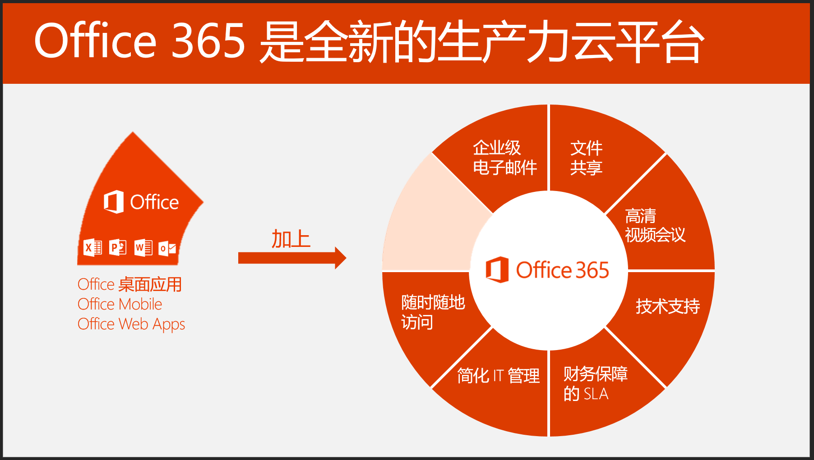

与此同时，Office 365还在不断地创新，推出新的服务，很多都是免费提供给现有Office 365用户的。下面是目前国际版的截图。

Office 365是一个全球运营的服务，目前我们在全球38个不同的地区都有Office 365的数据中心，请参考 [http://o365datacentermap.azurewebsites.net/](http://o365datacentermap.azurewebsites.net/)。

与此同时，在中国我们有两个完全独立的数据中心（分别位于上海和北京），由世纪互联负责运营。请参考 http://www.21vbluecloud.com/office365。

> 除了全球统一的那个国际版之外，在世纪互联运营的这个版本，我们内部称之为Gallatin，大部分中国的客户都是购买这个版本，但也有一部分有海外业务的中国客户，会购买另外一个代号为Yellowstone的海外版本（特指数据中心在香港或新加坡的版本）。

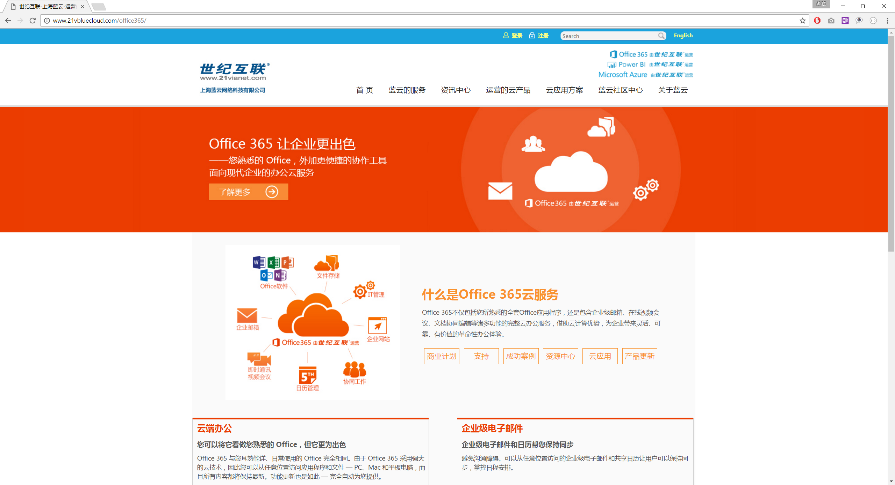

最后，Office 365是基于订阅进行授权的，用户可以按需订阅组件，按照具体使用的时间付费，而无需一次性购买。针对不同的组织或个人，Office 365提供了丰富多样的订阅选项。详情请参考 https://products.office.com/zh-cn/business/compare-more-office-365-for-business-plans

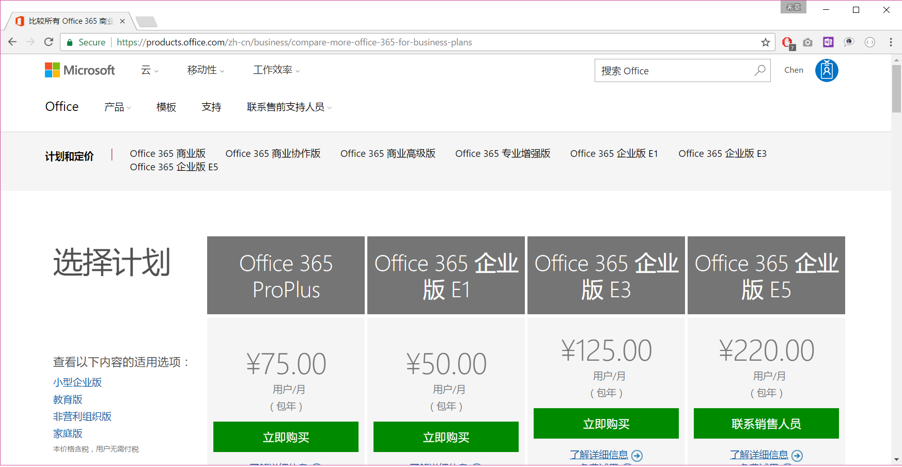

> 教育版和非营利组织版订阅费用极低，甚至免费。

世纪互联的授权计划大抵上跟国际版类似，但也有些细微的区别，有兴趣的请参考 http://www.21vbluecloud.com/office365/pricing.html。

从功能角度来说，核心的功能都已经落地到Gallatin，但是确实有些新推出的服务，会有一定的部署周期。本系列文章后续提到这些服务的时候，会做出一定的说明。

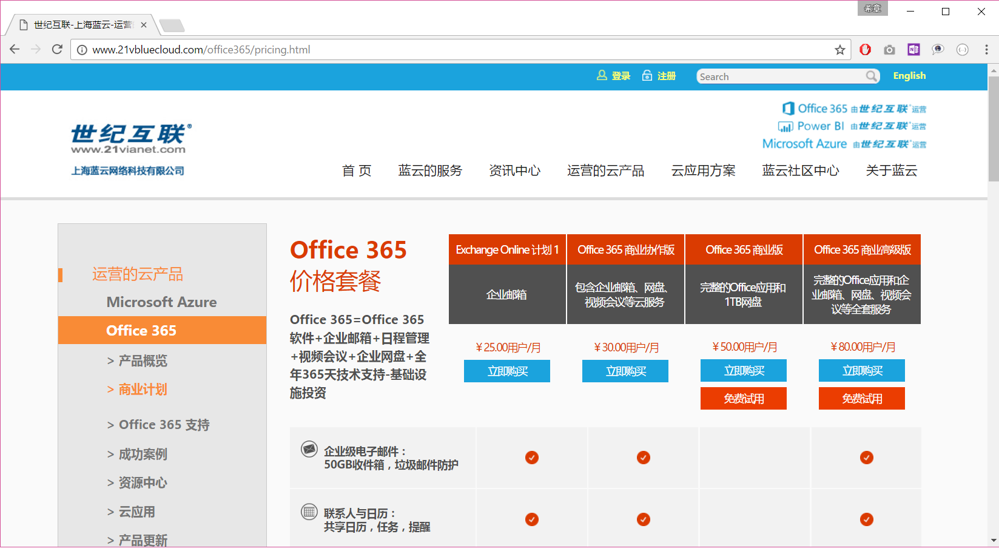

那么，在了解了Office 365的这些背景之后，我们再来看一下在Office 365 这个全新的生产力云平台上面，对于开发人员来说有哪些机会。

平心而论，Office 365 本身提供的功能和服务已经非常丰富，甚至强大到让我们的客户都觉得目不暇接，日常用到的功能可能也只有全部功能的一小部分。但是，Office 365毕竟是一个基础性的平台，我们的客户不会为了用Office 365而用Office 365，而肯定是为了解决他的业务需要而使用的。打个比方说，客户用Word，并不会是仅仅因为Word是一个世界一流的字处理软件，而是因为他（她）要编写一份自己想要的方案或者论文，而Word正好可以帮助到他。从这种层面上来说，客户的业务需求肯定是千奇百怪的，而且永远不会被完全满足，尤其不可能靠微软一家之力、靠Office 365的标准功能就能完全满足。

所以，Office 365继承了Office的一贯的优良传统，从设计的一开始，从架构上面来说就支持开发人员在其基础上，按照业务的需求进行定制和扩展，官方的Office开发中心清晰地展示了这方面的能力，具体来说可以有下面四个主要的场景

**Microsoft Graph**

通过Microsoft Graph，可以让你的自定义应用系统（不管是Web 应用，还是桌面应用，抑或是移动App）通过统一的、RESTful的接口访问到授权用户的Office 365的资源。稍微深入地展开一点来说，一方面你的应用可以使用Office 365提供的Identity 服务，简化和统一身份验证环节；第二方面，你将直接将Office 365的能力无缝地集成到你的应用中去，免费享受到微软强大的基础投资带来的好处。

下图提到的这个随办的应用，是目前国内做得很完善的与Office 365应用集成的成功案例，有兴趣可以参考

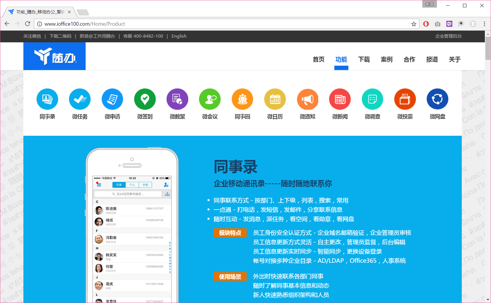

> 关于Microsoft Graph，我在本系列文章的第三篇将详细展开探讨，如果有兴趣的朋友，请先了解 https://developer.microsoft.com/en-us/graph/

**Office Add-ins**

Add-ins对于Office开发人员来说并不是新事物。上一篇文章我已经提到了VBA可以做Add-in（通常是通用的功能，不跟具体的文档有关，并且需要保存为特殊的格式——例如xlam或者xla这种才算，称之为Excel Add-in），VSTO也可以做Add-in（称之为COM Add-in）。

这两种Add-in，请姑且允许我将其称之为传统的Add-in。他们将需要在本地安装和部署，并且将出现在Office应用的如下界面中，可以按需要启用或者禁用。

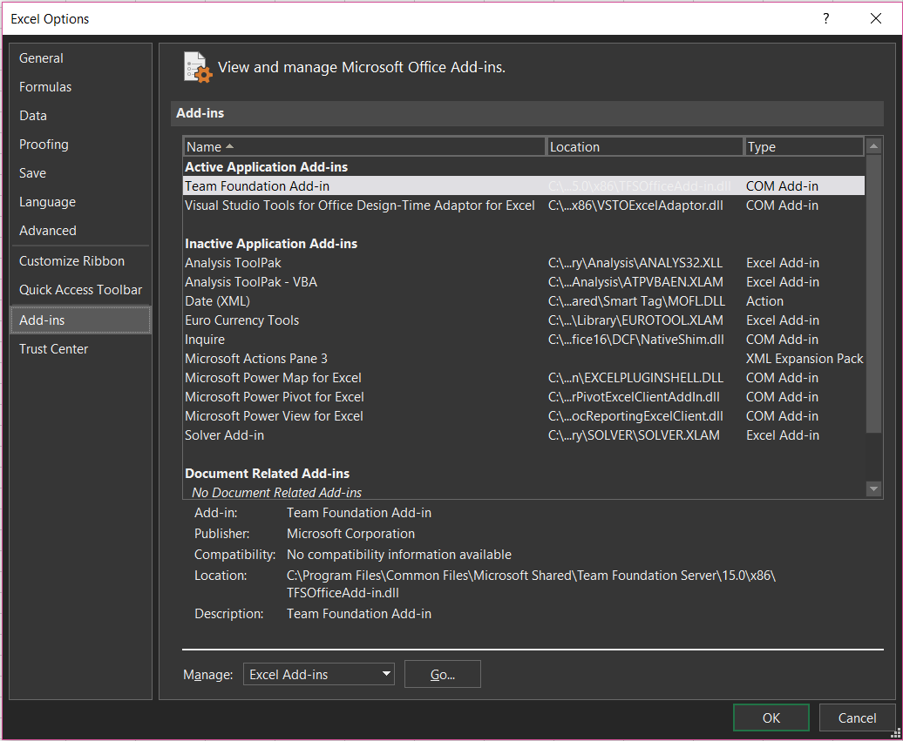

这两种Add-in的优势和劣势在上一篇文章已经有详细的说明，这里不再赘述。Office 365的Add-in指的是基于新一代的Web技术推出的Add-in开发能力，我可以将他们称之为Web Add-in。

我这里同样不会过分地展开细节，因为本系列文章后续有五篇文章专门讲解这个内容。我只希望大家能够明白，为什么会推出Web Add-in这种新的开发模式？其实很简单：

第一我们希望提供给开发人员更好地分发Add-in的能力，如果要首先这一个目的，就最好不要依附在文档内部，不要在本地安装，不要再为版本更新操心费力，对用户来说实现一次订购处处可用。

第二，我们希望能够在移动设备也能使用这些Add-in，不必要为移动设备又单独做一次开发。

下面这个同样由随办团队出品的iOffice Add-in，可以安装在Outlook或者OWA中，这个目前是免费的Add-in，可以让随办的用户之间在Outlook中进行很多有意思的互动，包括查看联系人，分配微任务等。

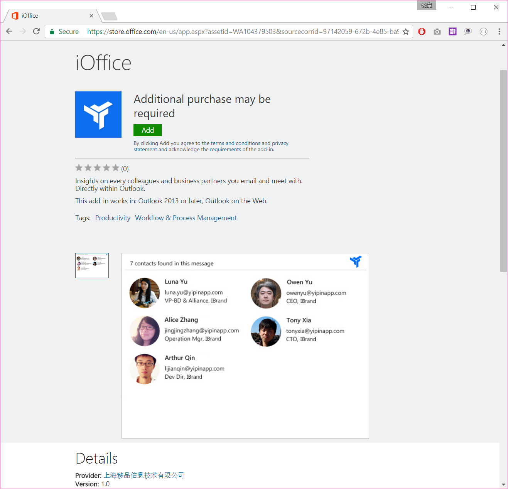

**SharePoint Add-ins**

之所以单独将SharePoint 的Add-ins拿出来，区别于Office Add-ins，是因为SharePoint指的是服务器端开发，在开发模式及要求的能力上面是不太一样的。但以我看来，SharePoint的开发人员，向Office 365转型会比传统Office开发人员向Office 365来的容易，原因在于，SharePoint的开发，虽然也经历过几种不同的历史阶段（例如最早的WSP，到后来的Farm Solution，到后来的Sandbox Solution，再到SharePoint 2013时代横空出世推出了App的模型），但本质上来说，其核心还是Web开发，所以有这种经验和基础的开发人员，在如今这种“移动优先、云优先”的大背景下，有着一些先天的优势，何况说，新的Add-in开发模式进一步标准化了，从逻辑上说应该还可能会更加容易一些。

目前在Office Store中有超过1163个SharePoint Add-in，占到全部Add-in的将近58%，足见其市场潜力。

**Office 365 Connectors**

Connector（直译过来是连接器）是一个全新的事物。它目前在Outlook Modern Groups以及最新发布的Microsoft Teams中起到连接外部应用系统或者信息源的作用。

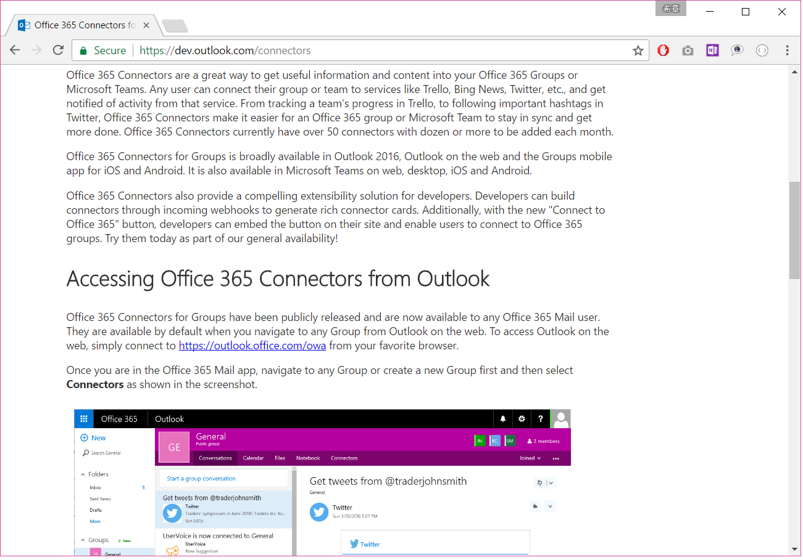

这个要讲起来，最根本的一点是大家要理解在企业内部协作的时候，最重要的是一个团队的概念，而在团队的一个共同的工作区中，我们称之为Group。在Group（Teams中称为Team）的日常协作过程中，可能有链接外部的应用系统或者信息源，以便在这些系统或者信息发生变化的时候，团队能以一种透明的方式得到通知。Connector就是做这个的。目前已经默认提供了超过50个标准的Connector，但开发人员可以根据自己需要进行定制。

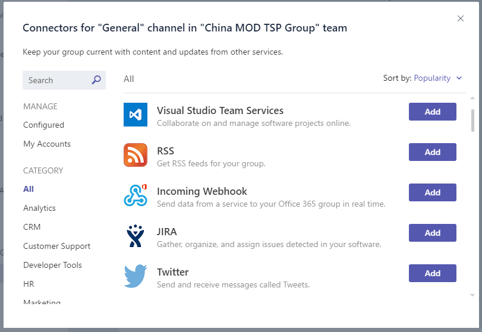

介绍完了Office 365开发的典型四大场景（Microsoft Graph，Office add-ins，SharePoint Add-ins，Office 365 Connectors），这里快速给大家提一下，作为开发人员可以使用哪些平台或工具来开展工作。

从下图可以看到，目前支持的开发平台除了ASP.NET，还有Android+iOS这种Native App平台，也有完全基于Javascript以及NodeJS的开发支持。这是一个开放是世界，Office 365的开发掀开了崭新的一页；对于开发人员来说，会有一定的挑战，但我相信机遇更加大。

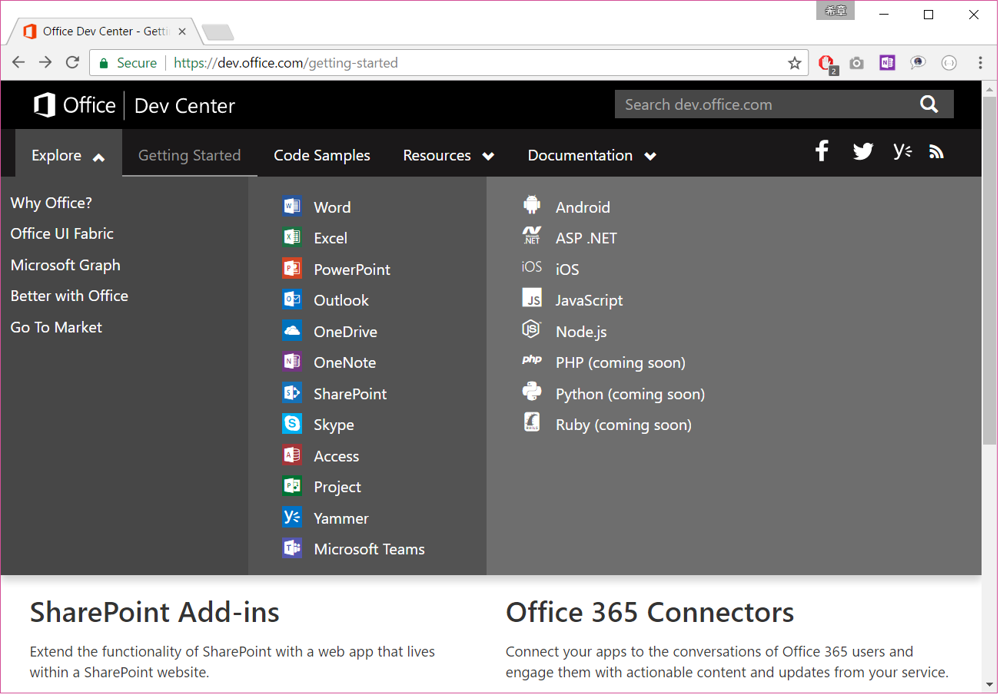

## Office 365生态环境介绍

我很喜欢生态环境这个词，而且我自己对这个词很有感触是前些年看电视节目说到某些地区由于某个物种的恶意捕杀，导致了食物链上其他一批物种也相应地灭绝，让人触目惊心。从当前的经济全球化和扁平化的大背景来看，几乎所有的公司都不可能完全靠自己赢得一切，而如果是失败，也不可能仅仅是自身能力不够这么简单。我不是什么大领导，只是结合自己的经验来谈一下Office 365相关的生态环境及其建设。

我在“[风起云涌：西雅图技术培训见闻分享](http://www.linkedin.com/pulse/%E9%A3%8E%E8%B5%B7%E4%BA%91%E6%B6%8C%E8%A5%BF%E9%9B%85%E5%9B%BE%E6%8A%80%E6%9C%AF%E5%9F%B9%E8%AE%AD%E8%A7%81%E9%97%BB%E5%88%86%E4%BA%AB-%E5%B8%8C%E7%AB%A0-%E9%99%88)” 这篇文章中提到，我理解微软的成功法则是通过紧密团结和帮助客户和合作伙伴成功来获得成就。

这可能看起来有点抽象，我们谈点实际的。Office 365作为一个逐渐完善和成熟起来的全球性生产力云平台，他已经取得的一些成绩，以及将要进一步的发展，都完全离不开客户和合作伙伴的参与。

从客户这个角度来说，我们看到越来越多客户认识到Office 365所带来的全新价值，在自身的数字化转型过程中，利用Office 365提供的生产力解决方案（而不仅仅是产品）取得先机。
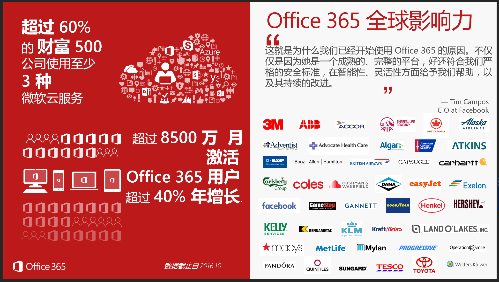

Facebook的选择让我们看到这种级别的科技企业的决断力，也许这正好是他能专注于业务创新的动力之一。

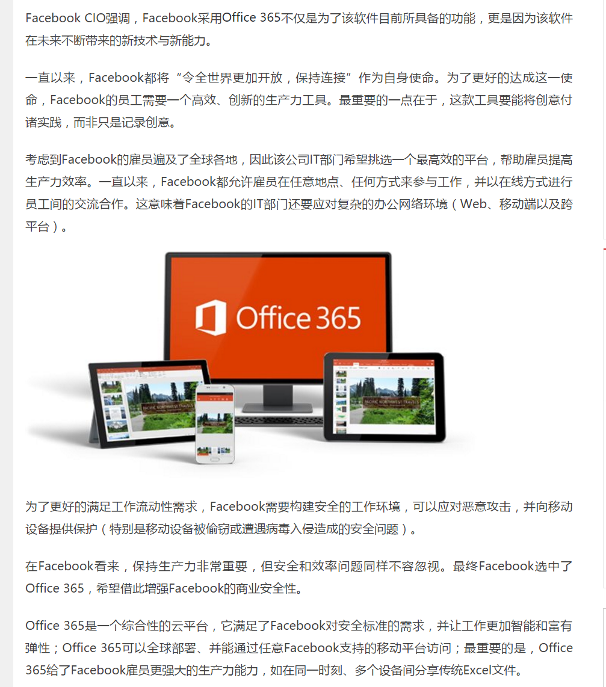

合作伙伴体系一直是微软的重要资产，在全球有数以百万计的各种规模的合作伙伴，这一点都不夸张。每年都有一次规模盛大的全球合作伙伴大会，今年的大会将在华盛顿举行，有意思的是，这一届又与时俱进地改了名字，希望进一步激励和启迪所有人在数字化转型的道路上锐意创新吧。

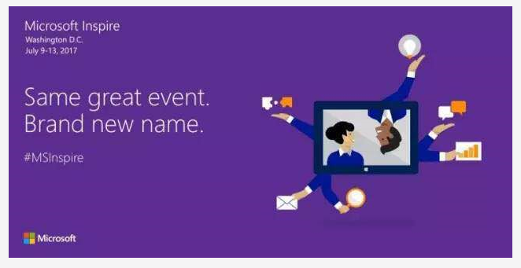

开发人员是Office 365生态中的重要力量，在微软内部研发工程师仍然占了大部分的比例，至少包括基础架构的开发团队，Office 365功能开发的团队，以及为Office 365设计接口的团队，还有一些特殊版本本地化的研发团队等。

对于合作伙伴的开发团队，最重要的是结合自身业务或者客户需求，选择合适的切入点和自己熟悉的技术，优势互补，利用Office 365平台提供的基础能力快速开展创新。

为了更好地建设围绕Office 365的中文用户社区，微软有多个部门都在积极努力，下面这篇文章我详细地介绍了这方面的信息，如果有兴趣的朋友请参考

[介绍Office 365 中文用户社区 4.0](office365community.md)