# 拥抱开源，Office 365开发迎来新时代

> 作者：陈希章 发表于 2018年4月17日

## 前言

作为全球最大的开放源代码托管平台，Github在上周迎来了它的十岁生日。自从2008年正式上线以来，Github上面汇聚了数以千万计的开发人员和各种项目，它几乎成为了开源的代名词和风向标，各大软件巨头都纷纷支持，在广大程序员心目中，也更是精神图腾一般的存在，坊间戏言它是最大的同性交友平台。

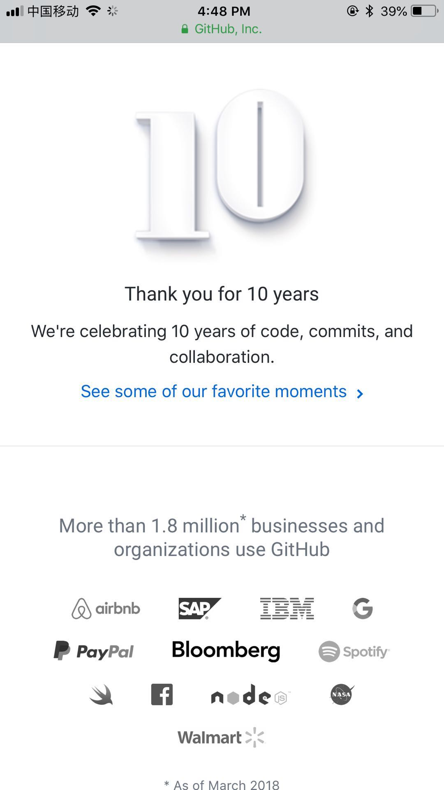

我自己对开源了解不多，并且能力也有限，一直没有在这方面有所贡献，但我肯定和大家一样都是Github的受益者。今天这篇文章一方面是希望借此为Github庆生（本来是上周想写，但一直没有时间），另外也是因为最近有开源社区的朋友邀请我有机会谈一谈这些年Office 开发（尤其指Office 365开发）中对开源平台的支持，这方面我多多少少知道一点，就斗胆写出来，也算是向“开源”精神致敬吧，请大家参考。

> 本文以及这个系列文章都是托管在`Github`上面，用`markdown`这种自由奔放的轻量级标记语言写成，使用的工具`Visual Studio Code`也是开源的，欢迎到<https://github.com/chenxizhang/office365devlabs> 上面来提`issue`，欢迎给我`star`给以鼓励，欢迎`fork`这个`repo`并且通过`pull request`提交你的见解。

## 微软的开源行动

微软这几年内部进行了深刻的转型，为外界所熟知的除了有业务方向的变化、组织的调整、股价的飞涨之外，时不时会有一些让业界“看不懂”的新动作，过去的不多说，今天最新的一个劲爆新闻是微软也要推出自己定制版本的Linux，不仅让人感慨这世界到底怎么了。

但要论起微软在开源方面的努力，其实在多年前就开始了。2006年前后，微软发布了Codeplex网站，当时也是规模不小的开源代码托管平台，微软自己有很多著名的项目，都是在这个平台上面开放源代码，包括ASP.NET等，但后来的故事大家也差不多知道，随着Github的崛起并且成为事实上的标准，微软将几乎所有项目迁移到了Github，并且于2017年12月份正式封存了Codeplex（目前继续提供只读查询，和下载服务）。

2014年4月，微软宣布成立.NET基金会，同时宣布释出.NET编译器平台Roslyn，作为开放源代码软件。11月释出在服务器上运行的.NET Core源代码，交由.NET基金会管理，鼓励自由软件社群参与将.NET软件平台移植到Linux与Mac OS上。基金会由开源社区的大神Miguel领衔，管理着55个正式的项目，不少业界的知名公司也是基金会的重要成员，包括Google，三星等。

> 值得一提的是，.NET基金会的源代码也是托管在Github上面的，地址是 <https://github.com/dotnet>。

回到Github上面来，据不完全统计，目前微软员工参与Github的人数是全世界最多的，所有项目获得Star总数组织排名全世界第三。下面我有一个不完全的统计，可以看出近四年来，微软在Github上面的贡献稳步攀升的表现，目前的Repository数量至少有 2054 个。

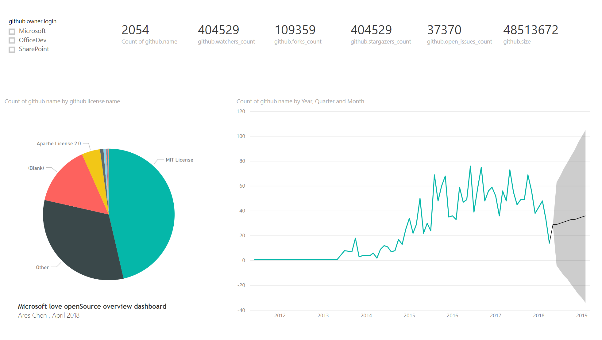

目前在Github上面，微软最受欢迎的40个项目如下

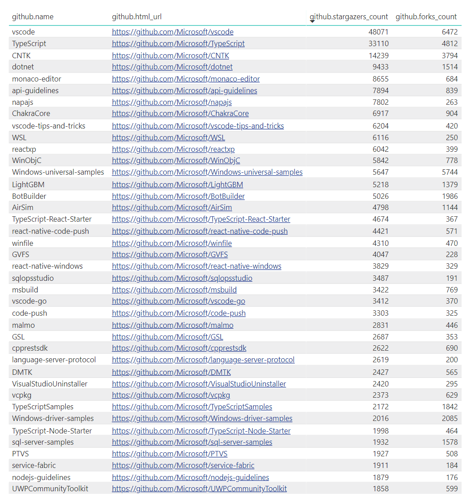

## Office 365开发拥抱开源

那么，我们来看看Office 365的开发，到底跟开源有什么关系呢？在Github上面，微软除了有一个最大的组织（<https://github.com/microsoft>）外, 还有两个跟Office 365开发直接相关的组织，他们分别是

1. SharePoint 开发 ：<https://github.com/sharepoint>
1. Office 365 开发 ：<https://github.com/officedev>

SharePoint开发十大最受欢迎项目如下所示

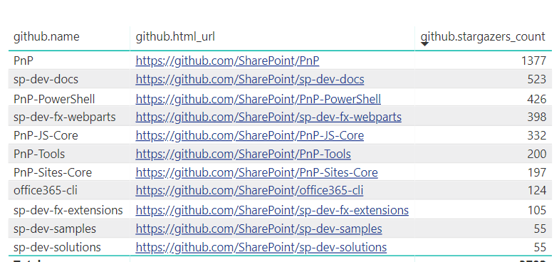

Office 365开发中star数量超过100个16个项目如下

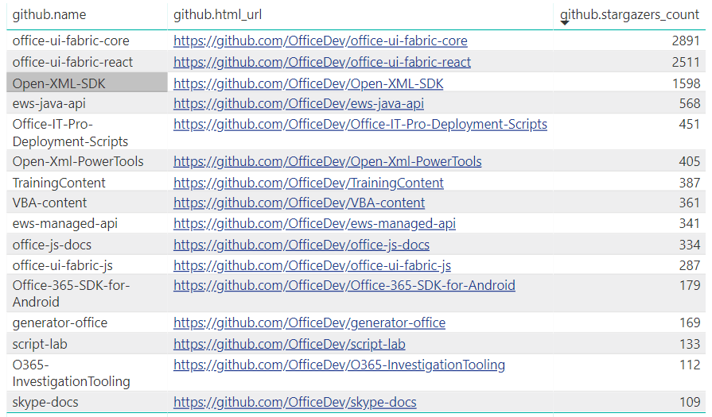

以上是微软产品组不断贡献出来的一些项目。接下来，我还要谈一下在Office 365开发的不同层面是如何支持开源平台的。目前来说，我们一般将Office 365的开发分为如下几个领域

1. 使用Microsoft Graph将你的业务应用与Office 365无缝整合。
1. 通过Office Add-in的技术扩展你熟悉的Office应用程序。
1. 通过SharePoint Add-in的技术打造基于SharePoint的业务应用。
1. 基于Microsoft Teams开发智能机器人或者业务选项卡、连接器应用。

### Microsoft Graph对于开源平台的支持

使用 Microsoft Graph API 轻松连接到可加快工作效率的数据 – 邮件、日历、联系人、文档、目录、设备以及在这些数据中发现有价值的信息 —— 不夸张地说，如果说员工和知识是企业的两大无形资产的话，那么Microsoft Graph就是一个宝藏，它不仅代表着现在，也意味着未来极大的可能。

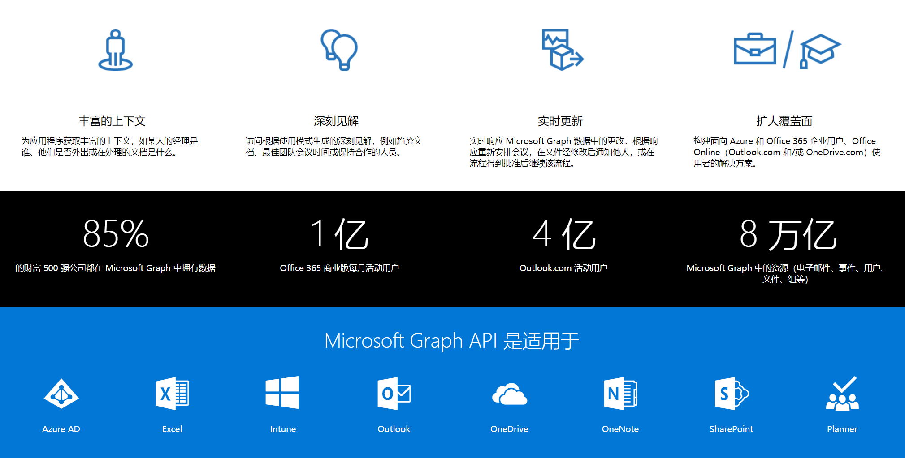

为了让Microsoft Graph能够极大地方便开发者调用，从一开始的设计理念，就是要支持所有的开发平台 —— 不管是开源的，还是不开源的。这一点是由Microsoft Graph的工作机制来保证的 —— 它就是一套标准的REST API。

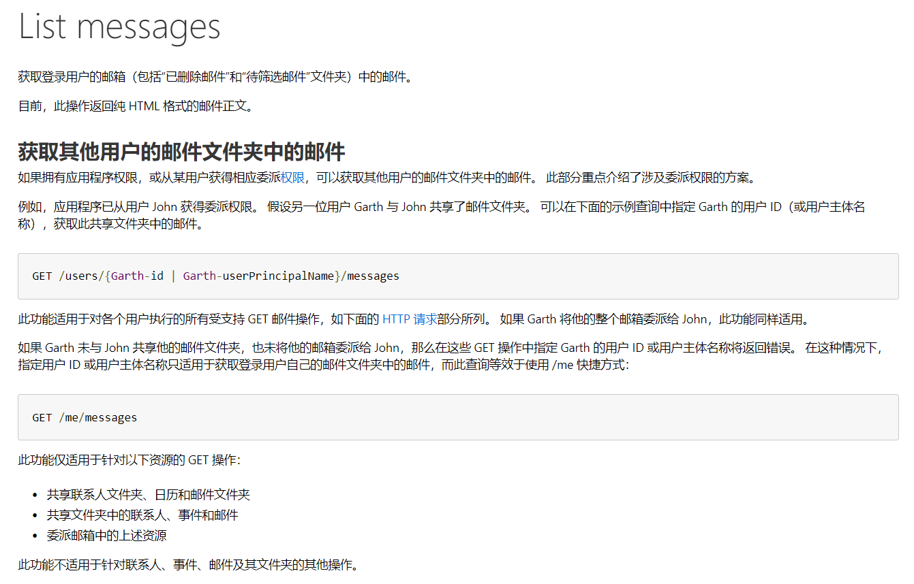

这些API都是返回Json数据格式，而且完全基于OData的规范设计，支持标准的查询参数。

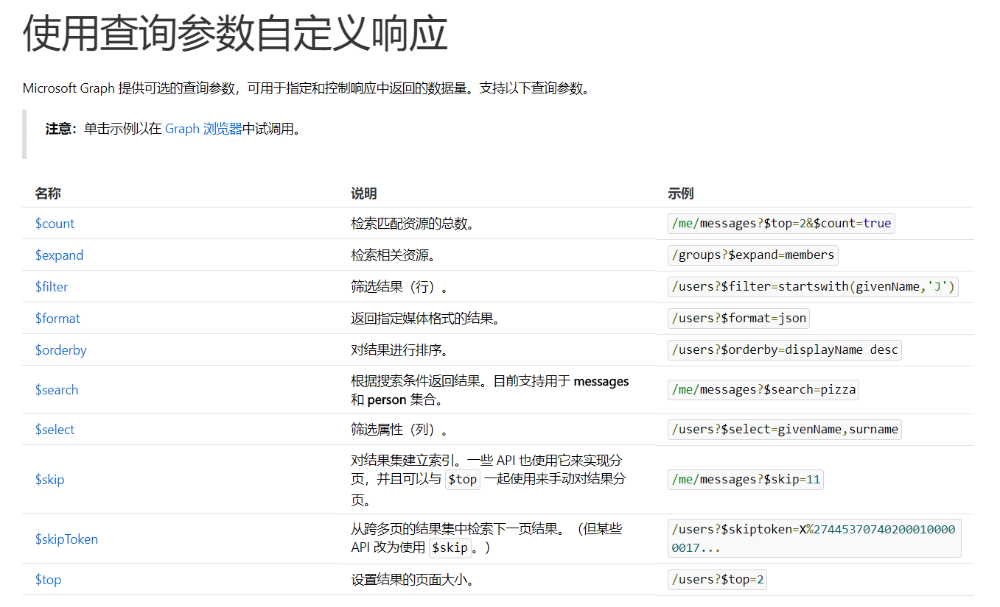

除了REST API ，微软也有针对主流的平台提供了SDK，可以加快开发的速度。

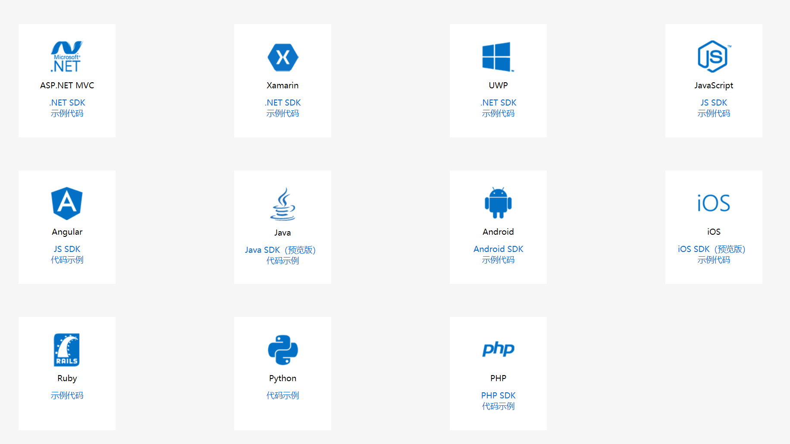

### 使用Visual Studio Code快速开发Office Add-in

我此前有过一篇[文章](vscodetoofficeadd.md)专门介绍这个主题，这里简单地整理几个要点。

 要开发Office Add-in，你现在有多个选择

 1. 如果你是Visual Studio的资深用户，你的经验可以很好地复用，Visual Studio 2017提供了开箱即用的Office Add-in模板，几次点击就可以创建一个项目，并且可以一键进行调试。
 1. 与此同时，你可以使用Visual Studio Code这个开源的编辑器，结合 NodeJS、 Typescript、React、JQuery 等开源平台和框架来构建你的Office Add-in，在设计你的UI时，你还开源直接使用微软开源的Office Fabric UI呢。

下面我演示一个基本的步骤

1. 安装环境（NodeJS，Visual Studio Code）
1. 安装Office Add-in项目生成器 `npm install -g yo generator-office`
1. 创建项目 `yo office`

    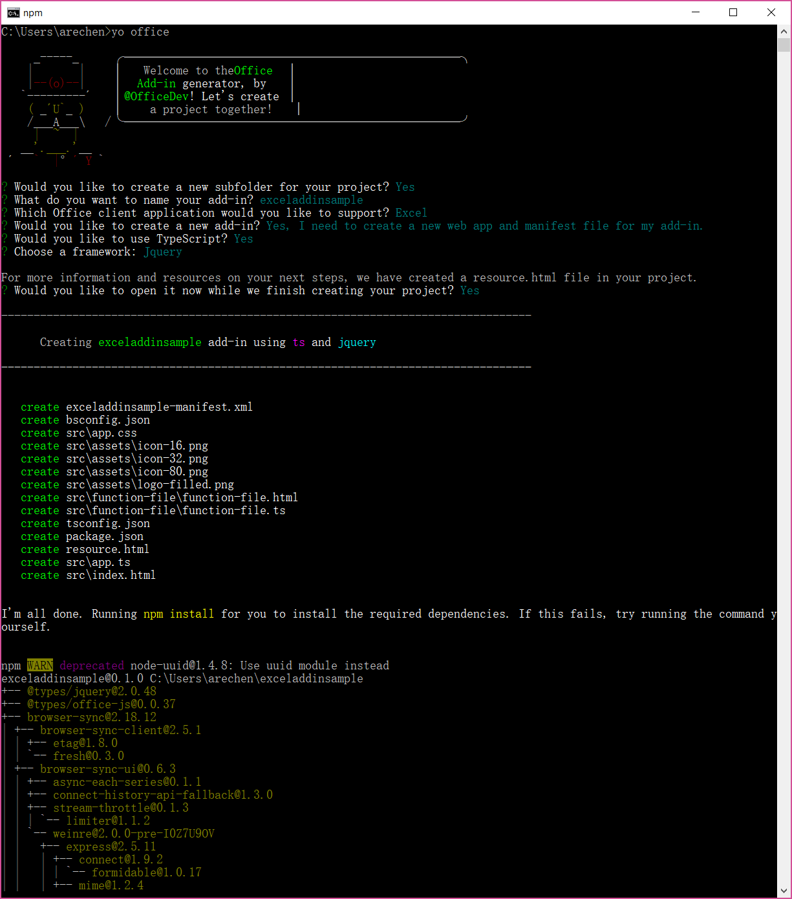

1. 在Visual Studio Code中编辑和调试项目

    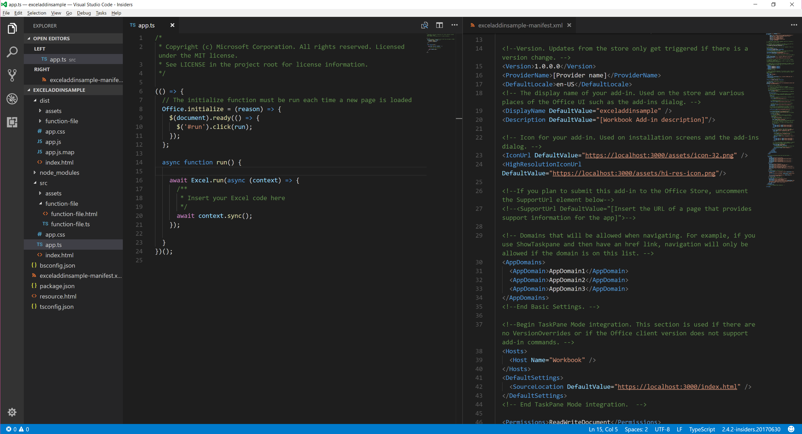

Visual Studio Code的话题也许三天三夜都讲不完，但通过上述的介绍，大家可以看到现在开发Office Add-in是一种全新的体验，你可以使用你最熟悉的编辑器，搭配你最喜欢的框架来工作。

### 全新的SharePoint Framework，全新的组件式开发体验

与Office Add-in一样，我此前也已经有专门的[文章](sharepointframework.md)介绍和演示了SharePoint Framework的开发体验，这里也仅仅是将与开源相关的内容重点整理给大家参考，SharePoint Framework开发的最便捷步骤如下：

1. 安装环境（NodeJS，Visual Studio Code）
1. 安装模块 `npm install -g yo gulp`
1. 安装SharePoint Framework 项目模板 `npm install -g @microsoft/generator-sharepoint`
1. 创建项目 `yo @microsoft/sharepoint` 推荐使用React

    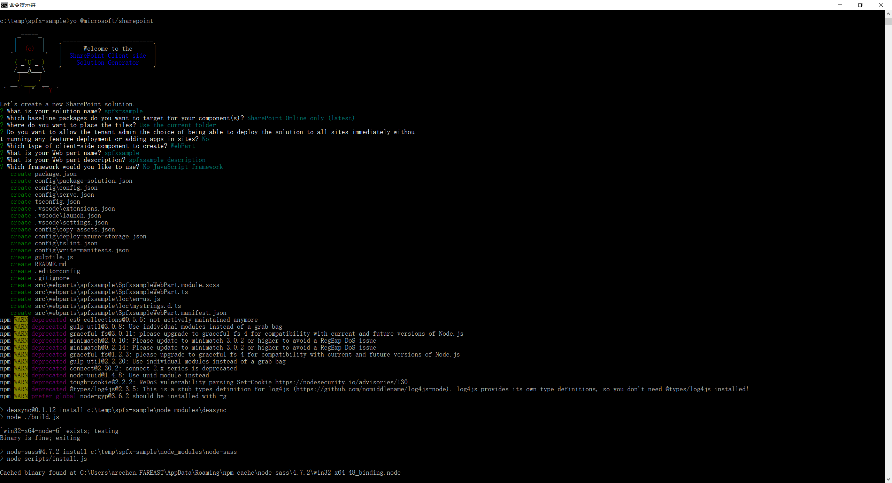

1. 运行和调试项目 `gulp serve`

    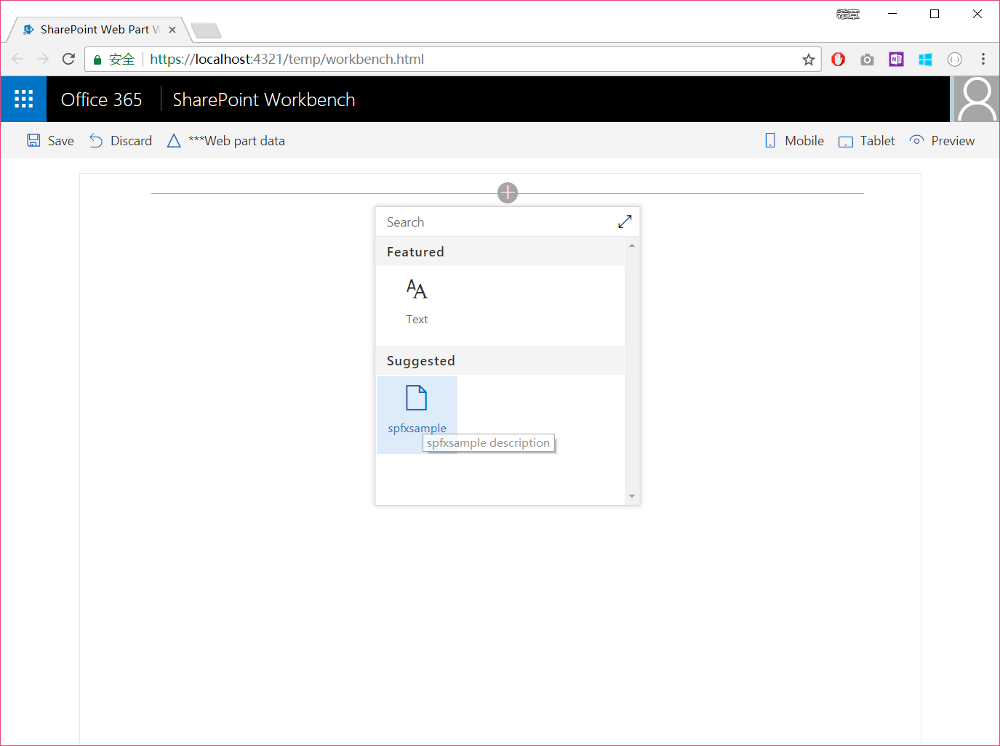

1. 在Visual Studio Code中编辑项目(图略)
1. 部署项目 `gulp bundle`，`gulp package-solution`

### Microsoft Teams的扩展开发体验

Microsoft Teams是Office 365中一个重要的创新，它可以将团队协作提升到一个新的层次。从另一方面，开发人员也可以在这个平台上面拥有全所未有的能力，例如：

1. 为Teams定制智能会话机器人 (Bot)，以全新的交互方式为用户提供服务
1. 将业务应用，以选项卡（Tab）的方式集成到Teams的频道中来
1. 定制消息扩展（Message Extension）及连接器（Connector，Webhook），与外部系统进行松耦合式的对接

听起来有点复杂，但其实做起来真的不难，请参考下面的步骤

1. 安装环境（NodeJS，Visual Studio Code）
1. 安装Teams项目模板 `npm install yo generator-teams -g`
1. 创建Teams项目 `yo teams`

    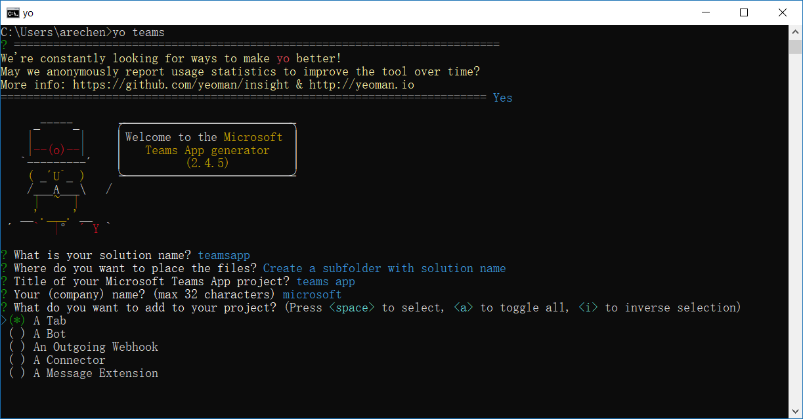

1. 在Visual Studio Code中编辑项目

    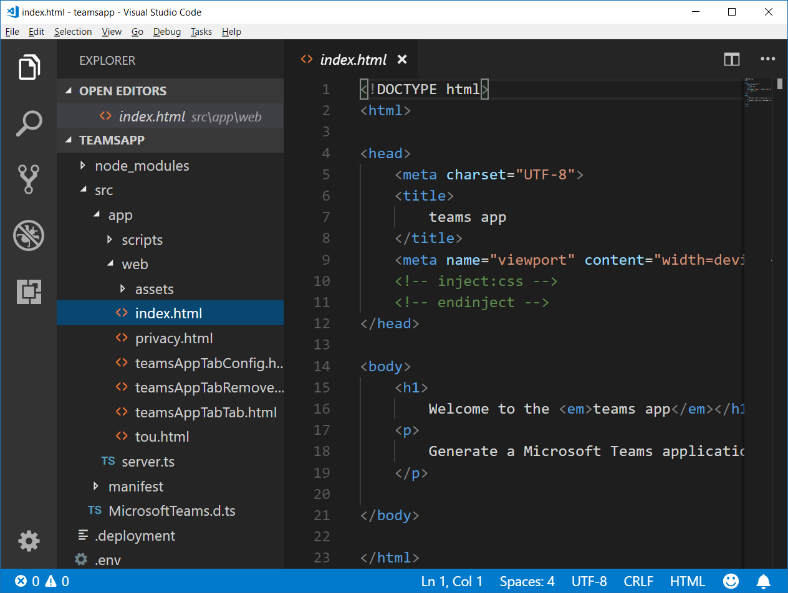

你可以通过上面的步骤快速创建一个Microsoft Teams应用，但是要做出来一个真正可用的App，你毫无疑问还需要更多的时间，请参考官方的文档 <https://docs.microsoft.com/zh-cn/microsoftteams/platform/>

上面提到的Office Add-ins、SharePoint Add-ins、Teams App开发，你可以看到针对NodeJS都提供了第一优先的支持，这是实实在在地爱开源啊。但我也必须说明的是，`Office Add-ins`、`SharePoint Add-ins`、`Teams App` 的开发支持任何的开发平台，因为他们说到底就是一个标准的Web应用，只不过还没有像NodeJS这样上升到工具和模板层面（这个可以通过开源社区大家努力来实现），所以你可以使用`ASP.NET Core`、`Python`、`Php`等进行开发，并且可以很方便地通过 `docker` 等一系列技术来实现devops。对，你没有听错，Office 365的开发当然也可以实现`devops`。

> 关于如何在docker中运行ASP.NET Core跨平台应用程序，我此前有一个文档可以参考 <http://www.cnblogs.com/chenxizhang/p/7148657.html>, 本书的范例是用ASP.NET Core编写，并且部署到了Azure的docker环境中。

## 结语

本文带领大家回顾了一下开源及社区的发展、微软在开源方面的努力，以及具体在Office 365开发的四个领域如何张开双手拥抱开源。一千个人的心目中有一千个哈姆雷特，但开源的精神应该只有一个，它不仅仅是开放源代码，它是一种开放的心态；同时开源需要更多的人参与、去贡献，只有这样，我们的“源”头活水才会生机勃发，越来越"开"阔。笔者今年的小目标是除了维护之前的一个小的开源项目外，争取参与到微软官方的几个大的Office 365开源项目中去做一点贡献，也希望看到更多的开发人员参与进来。