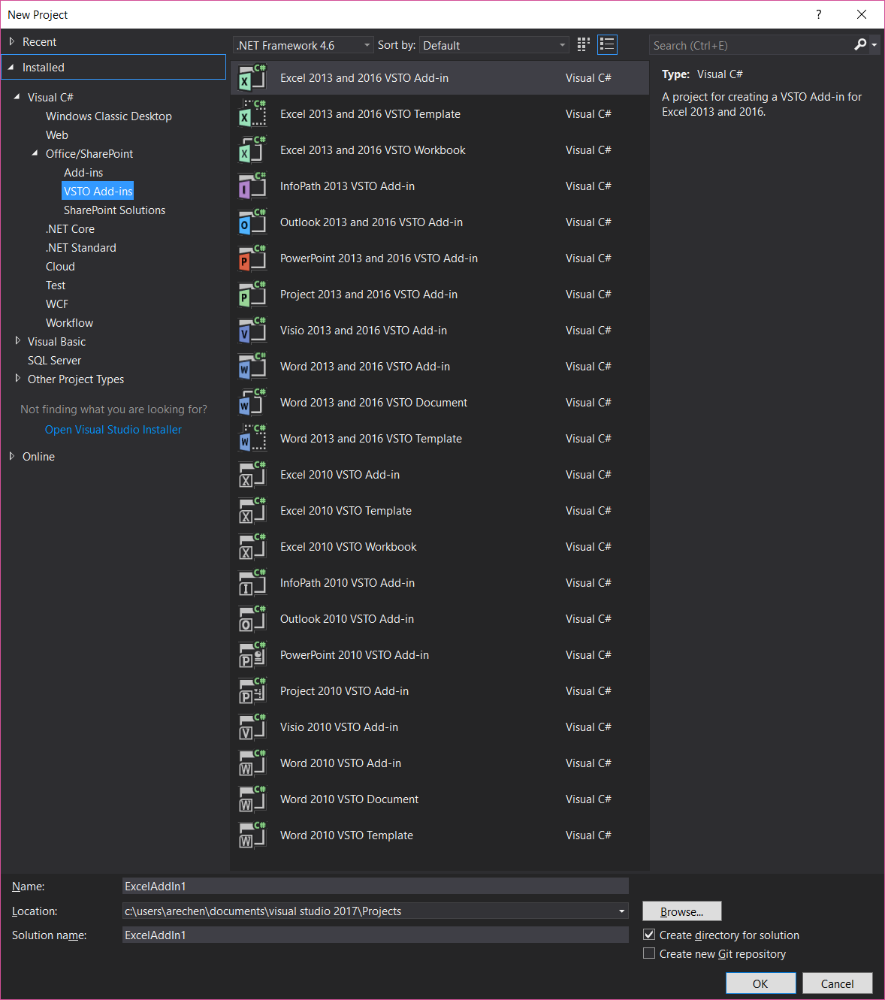
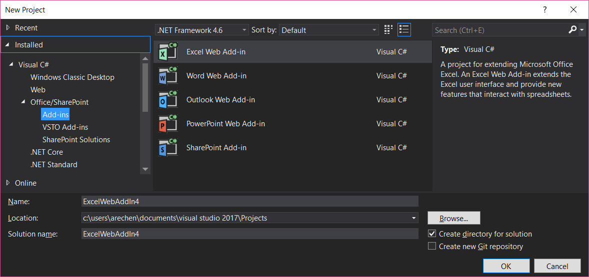
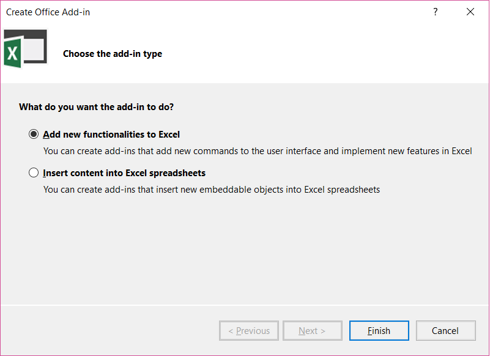
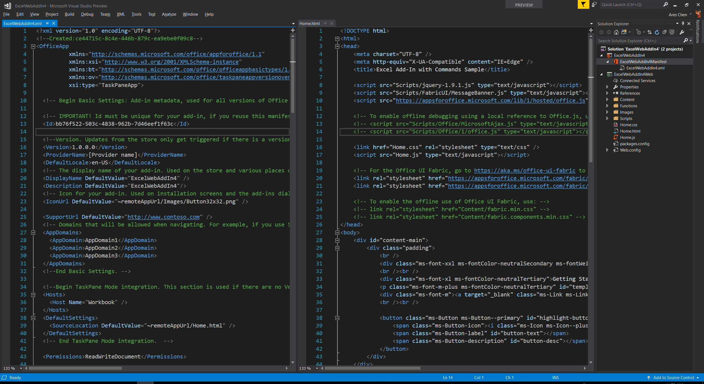

# Office Add-in 开发和部署体验
> 作者：陈希章 发表于2017年7月13日

“**Talk is cheap, show me the code**”，我们就用代码来说话吧。这一篇将给大家介绍如何开始Office Add-in的奇妙开发之旅。

[上一篇文章](officeaddins.md)已经提到过了，要进行Office Add-in的开发，你可以选择自己最喜欢的Web开发平台和工具。限于经验和精力，我这里展示的是用微软提供的Visual Studio系列工具进行开发。

## 在Visual Studio 中开发Office Add-in

Visual Studio这个宇宙第一的IDE伴随着我从对编程一无所知，及至靠编写代码为生，从入门到一直没有放弃，从Visual Studio 2005开始提供了对Office Add-in开发的内置支持。

当时的技术叫做VSTO——Visual Studio Tools for Office，其内在的机制是用托管代码封装了Office 的COM对象模型，我们在Visual Studio中编写C#或者VB.NET的代码，最终会编译成一个dll，打包成一个vsto的文件，部署到计算机的特定目录后，相应的Office客户端在启动的时候，就会加载这些vsto文件中定义好的add-in，并且执行其中的代码，或是自动执行某些功能（或者监听某个事件进行响应），或是在Ribbon中添加一些按钮，等待用户点击后执行某些操作。

每一代的Visual Studio都有对应的Office Add-in开发的更新。在最近的几个版本中，除了继续支持VSTO外，也一直提供了对于新一代Web Add-in的支持。

使用Visual Studio开发Office Add-in，用一句流行语来说，就是那么爽，因为有标准的项目模板，有向导式的工具，并且直接就支持一键式进行调试。我们下面就来体验一下吧。

> 由于不同的Office 客户端对于Add-in支持的功能会略有差异，所以基于你所选择的项目模板，你看到的向导界面可能也会略有不同

点击“Finish”按钮后，你应该会看到一个类似下面的项目结构

最左边的是manifest文件，中间是Web应用程序的首页home.html（你可以看到它用到了jquery, office.js，

## 在Visual Studio Code中开发Office Add-in

## 本地部署和调试

## Office Add-in的DevOps实践

## 发布到Office 365 App Catalog

## 发布到Office Store