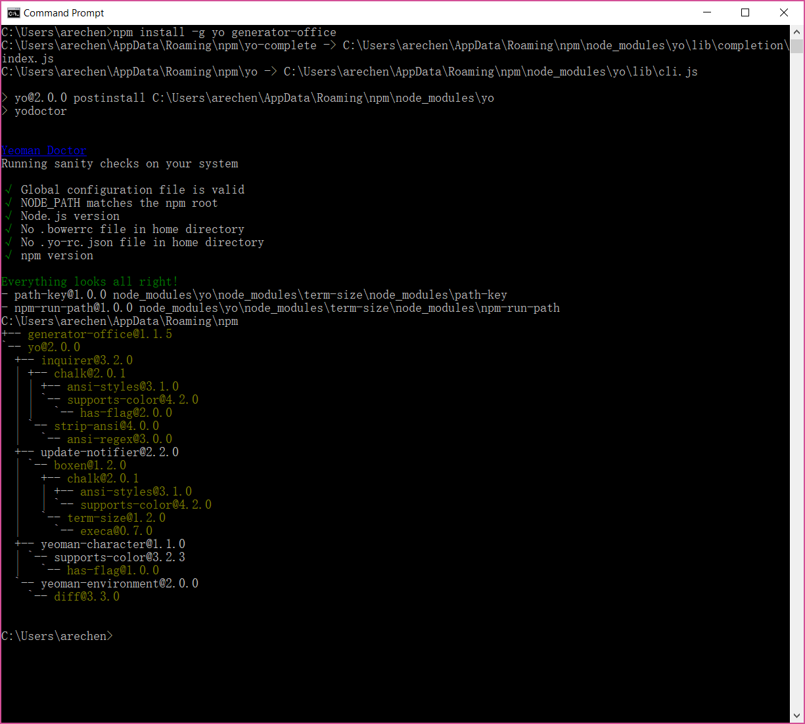
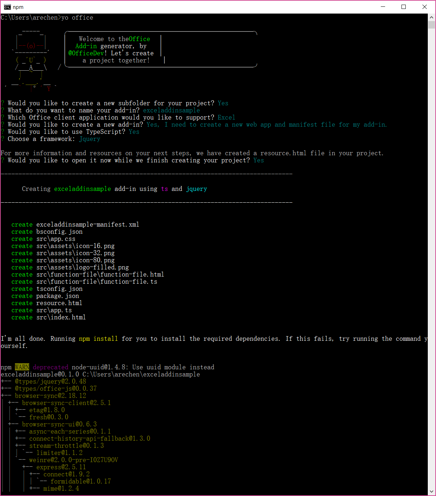
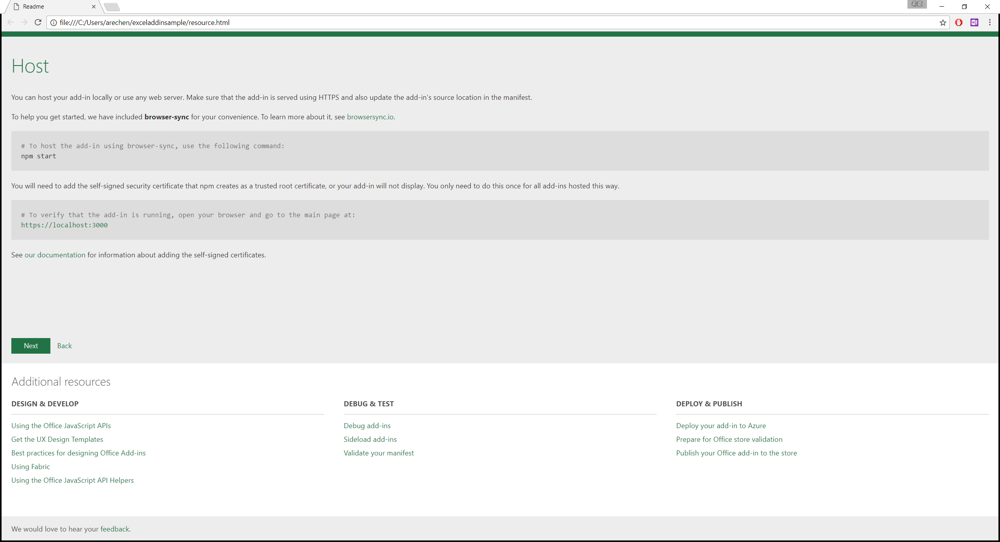
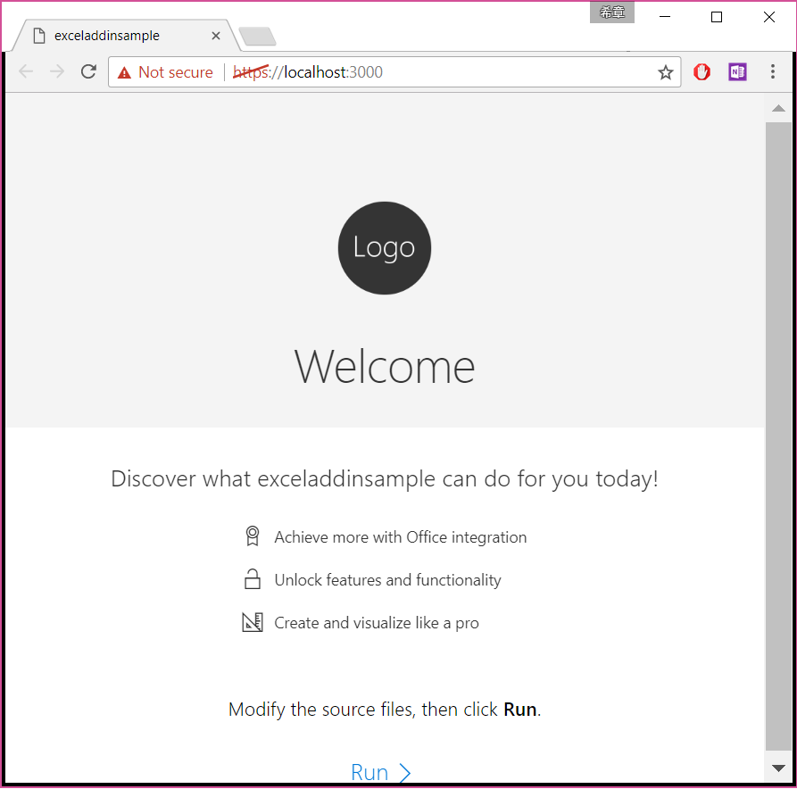
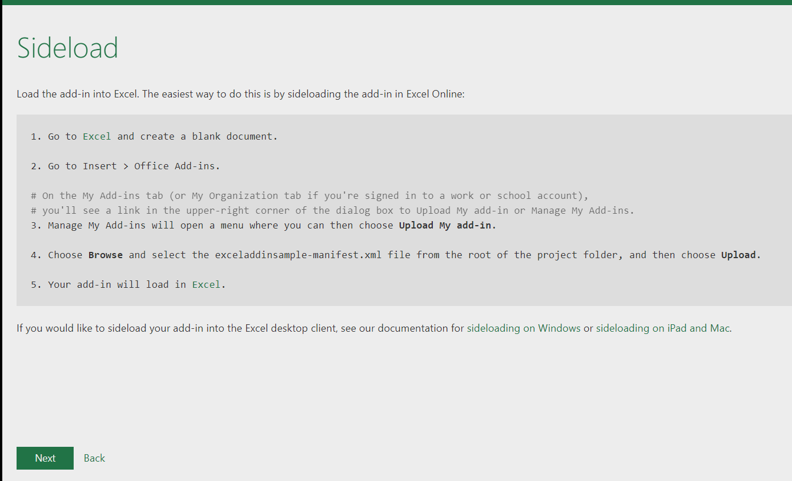
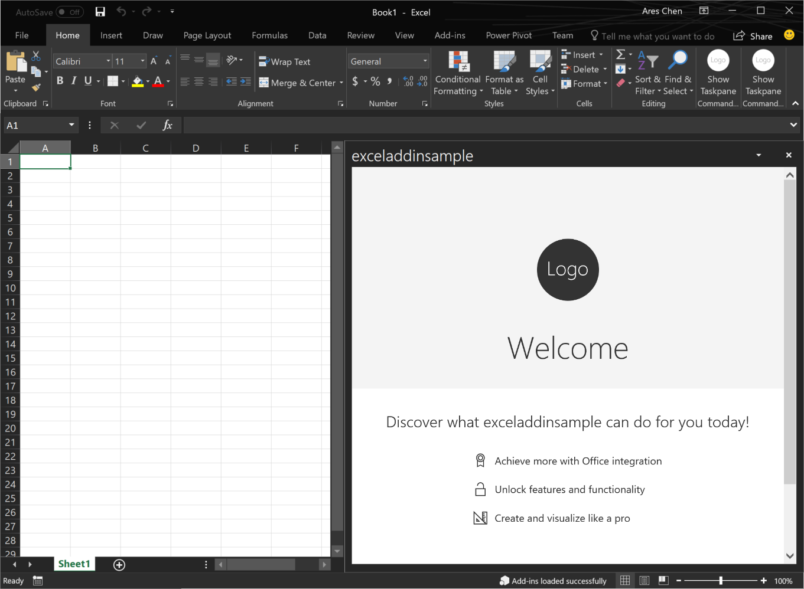
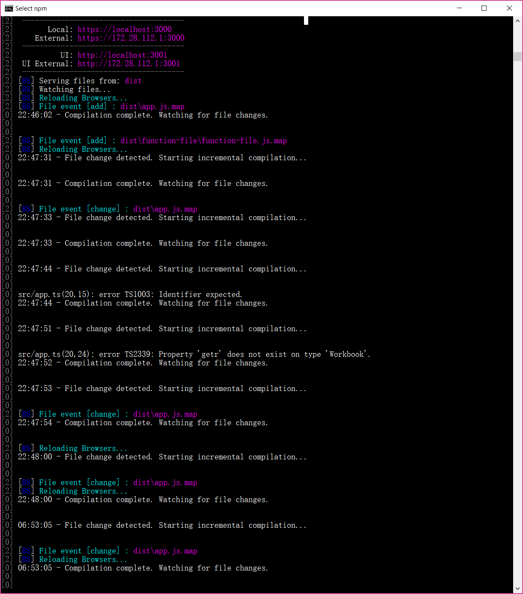
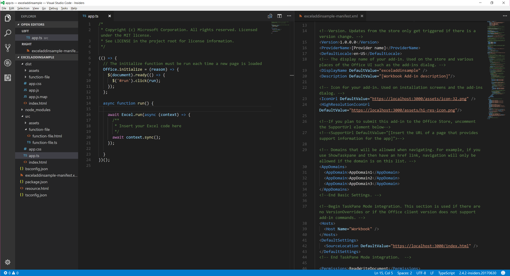

# 在Visual Studio Code中开发Office Add-in
> 作者：陈希章 发表于 2017年7月13日

[上一篇](officeaddindev.md) 我介绍了如何在Visual Studio中开发Office Add-in，因为有标准的项目模板，一系列配套的工具，尤其是自带的一键调试功能，可以让开发人员很快地开始探索。

有些朋友可能已经知道，Visual Studio家族这些年增加了一个新的成员—— [Visual Studio Code](https://code.visualstudio.com/)。这是一款跨平台的代码编辑工具（可以愉快地在PC,Mac,Linux上面运行），它更加轻量，主要面向新一代的Web应用开发人员而设计（毫无意外，它也吸引了包括我在内的老一辈的Visual Studio的忠实用户的广泛关注），对几乎所有的开源平台和开发语言都有较好的支持。

Visual Studio Code提供了对Office Add-in 开发的完美支持，这一篇文章就带领大家来完整体验一下。

## 安装工具

除了[安装Visual Studio Code](https://code.visualstudio.com/Download) 之外，要进行Office Add-in的开发，你还需要做一些额外的准备。这是跟Visual Studio略有不同的地方：它会多一些步骤，但这种留给开发人员的可控性也从一定程度上促使我们了解更多细节，我想这也是有不少开发人员喜欢Visual Studio Code（或者同类以代码为中心的编辑器）的原因之一吧。

1. 安装node.js。node.js 是这几年涌现出来的一个广受欢迎的全新开发工具，它颠覆了我们对于Javascript能力边界的认识，并且在高并发，但低计算的Web应用场景有较好的表现。关于这个话题，如果要展开来又可以讲几天几夜了，所以就此打住，请通过<https://nodejs.org/en/download/> 进行安装并且通过下面的命令确认其是否安装正确。

1. 安装node.js版本的Office add-in模板。虽然Visual Studio Code强调以代码为中心，但也不是说什么都要从零开始做。node.js的很多开发场景，也都有配套的模板来辅助开发。要实现这个目的，首先需要安装一个yo的模块。这是很有意思的，yo其实不是模板，而是一个工具，用来加载模板（或者在它来看是所谓的生成器—— generator）。下面这一行命令，既安装了yo，也安装了一个office开发对应的generator。
```
npm install -g yo generator-office
```
> yo 这个工具的全称是yeoman, 有兴趣请参考它的官方网站 <http://yeoman.io/>, 甚至也可以提交自己的generator




## 创建项目

做了上述的准备后，我们就可以通过一句命令来创建Office Add-in 项目了

```
yo office
```
此时同样会有一个向导问你几个问题，在你做出自己的选择并且最终按下回车键后，它就会自动地生成一个office add-in项目出来，这是一个基于node.js的项目。



如果你的最后一个问题跟我一样回答了“Yes”的话，在项目生成后，还会自动打开一个很贴心的操作指南



通过下面的命令可以将这个项目运行起来

```
npm start
```


## 调试项目

那么，怎么让这个add-in在Excel里面运行起来呢？上面提到的操作指南给出了一个步骤



但是，这个步骤可能是错误的。我在最新版本的Office 客户端中并没有看到上传add-in的链接。经过一些研究，我发现下面的方法是奏效的。

Sideload Office Add-ins for testing 
<https://dev.office.com/docs/add-ins/testing/create-a-network-shared-folder-catalog-for-task-pane-and-content-add-ins>

简单地说，你需要将add-in的manifest文件复制到一个共享目录


然后将这个目录加入到Office客户端的信任位置中去


> 如你所见，这里还可以设置其他一些catalog的路径，包括SharePoint站点。这个会在后续进行介绍。

完成上述步骤后，你就可以在插入add-in的窗口中看到相关的add-in了


如果点击“Add”，Excel会加载这个Add-in。作为一个还没有做过任何改动的标准add-in，它目前做的事情只会增加一个Show Taskpane的按钮，点击之后就可以打开任务面板。



> 需要注意的是，Office Add-in要求的Web Url是使用https的，而在本机测试的时候，因为证书是自签名的，所以会显示错误，但可以点击查看详情，继续运行

如果有兴趣，你可以留意一下此前那个命令行窗口



## 使用Visual Studio Code进行编程

使用Visual Studio Code打开这个项目（准确来说是一个目录，因为在Code里面其实没有项目的概念）后，会看到如下的目录结构



最右侧的manifest不用多说了，内容跟上一篇文章的例子是基本相同的。有意思的是中间的app.ts文件。这又是什么呢？

ts文件是TypeScript文件，而TypeScript是一种自由和开源的编程语言。它是JavaScript的一个严格的超集，并且添加了可选的静态类型和基于类的面向对象编程。[TypeScript](http://www.typescriptlang.org/)是著名的Turbo Pascal，Delphi和C#的发明者 **安德斯·海尔斯伯格** 的又一力作。很荣幸，神一般存在的安德斯是我现在的同事。

我不准备在这里对TypeScript进行过多展开，但我充分理解现在在看文章的你，可能会有这样的感慨：哇，看起来不错！嗯，又要学新东西了。

这是一个事实，但是我相信你会最终喜欢这种变化。欢迎来到一个全新的，动态的世界。


