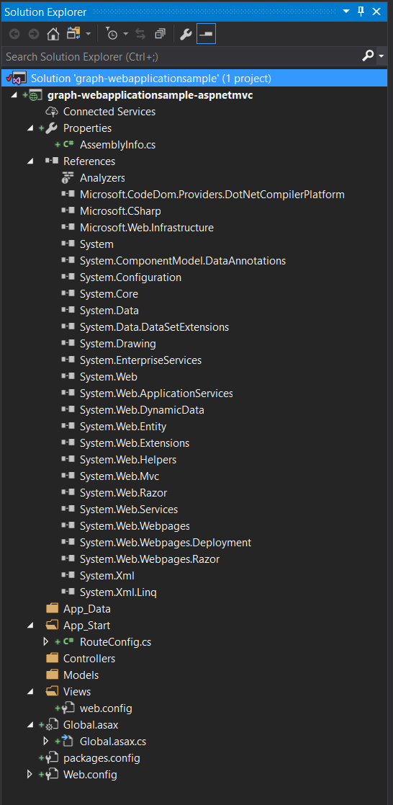

# Microsoft Graph Web应用程序
> 作者：陈希章 发表于 2017年5月2日

这一篇文章我们将用最简单的方式来创建Web Application，分别包括有用户界面的ASP.NET MVC应用，以及一个ASP.NET Web API服务.

## 注册应用程序

针对国际版Office 365，我采用Azure AD 2.0的方式注册应用程序
```
AppId:236ee598-8cf2-43ed-a371-d8a97f021dfc
Key: NYQkXRRuT3xJLxO98GTGZp0
RedirectUrl:https://localhost:44315/
Permission:files.read,mail.read,mail.send,user.read
```


针对国内版Office 365，我采用Azure AD 1.0的方式注册应用程序

```
AppId:9614f45c-7e3a-47ae-8478-8237d272a86e
Key:HBncSPMr5OKBqB5dUq77W6vACNF8NlXt0bgeTgy3MZU=
RedirectUrl:https://localhost:44315/
Permission:files.read,mail.read,mail.send,user.read
```


> 关于注册应用程序的细节，不清楚的读者可以参考之前的文章

## 创建ASP.NET MVC应用程序

为了让大家更加容易理解，如何用最小步骤一个ASP.NET MVC应用程序中添加Microsoft Graph的支持，请选择空白项目模板创建应用程序，但确保勾选了MVC


你看到的空白项目结构大致如下


接下来我们需要为这个应用程序添加对Microsoft Graph的支持，