# Microsoft Graph Web应用程序极致开发体验
> 作者：陈希章 重写于 2017年5月24日

## 前言
这篇文章最早写于2017年5月2日，当时的想法是从最简单的方式来写如何在一个ASP.NET MVC应用程序中集成Microsoft Graph，但实际上还真不是那么简单，至少我是不满意的，加上这一两周都比较忙，所以这一篇就一直搁置。直到上周的一个契机，让我看到了一个全新的方式，而且可以极大地改变我们在Web应用程序中集成Microsoft Graph，所以抓紧做了实践，写出来给大家参考。

在今年3月份Visual Studio 2017进行发布的时候，我已经发现它新增了一个很重要的功能，名称叫Connected Services，它提供了连接Azure AD，Office 365等云端服务的能力，这让我大喜过外，因为这确实是我们一直需要的东西。但仔细看下来，却发现这个第一版的功能，并不是最新的Microsoft Graph集成，而是Office 365传统的每个服务单独的RestAPI的接口。

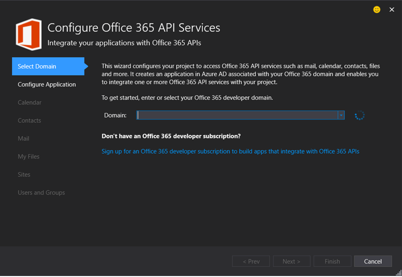

由于我正好在写这个系列文章，对Microsoft Graph有些研究，对其重要性深有感触，所以我当即给公司内部负责Visual Studio的最高领导（Julia Liuson —— 潘正磊女士）发了邮件提出意见，希望她能尽快考虑直接集成Microsoft Graph。没想到Julia很快就回了邮件，在表示亲切慰问的同时明确表态会尽快考虑这个需求，而就在前不久举办的Build 2017大会上，我们就看到了这个组件的更新，包含在最新的Visual Studio 2017 Preview中。

> 我将这个有意思的小插曲写出来，当然不是天真地认为这个更新的快速推出有我什么功劳。但从这里可以看出微软的产品组是很重视一线（包括客户，用户以及内部员工等）反馈的声音，而且他们的响应速度是非常快的。我必须为他们点个赞！

Visual Studio 2017 Preview是一个特殊的版本，可以单独安装，并且可以与现存的Visual Studio其他版本共存。它的下载地址在 <https://www.visualstudio.com/vs/preview/> .

与此同时，Microsoft Graph的官方网站也提供了一篇专门的文章介绍如何使用这个Connected Service来实现与Graph的集成，请参考 <https://developer.microsoft.com/en-us/graph/docs/concepts/office_365_connected_services>

## 根据范例快速体验

我非常推荐你根据官方文档的说明，下载它的那个[范例代码](https://github.com/microsoftgraph/aspnet-connect-sample/archive/Office365connectedservice.zip)来快速实践。

在Visual Studio 2017 Preview中打开上面这个解决方案，并且打开Connected Services的界面
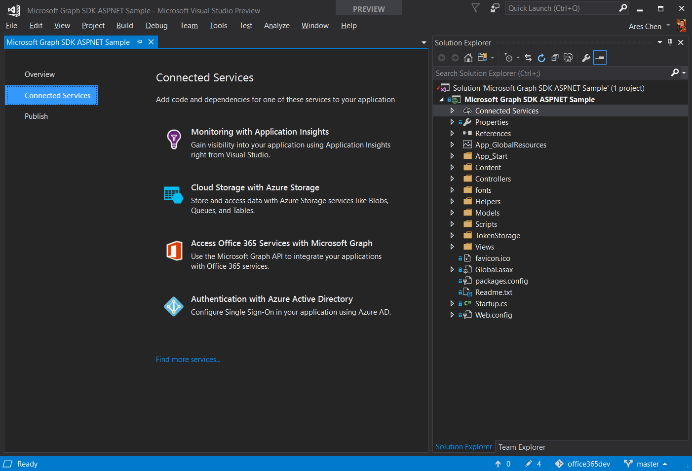

选择“Access Office 365 Services with Microsoft Graph”,输入或者选择你的Office 365 租户信息。请注意，这里目前还只支持国际版
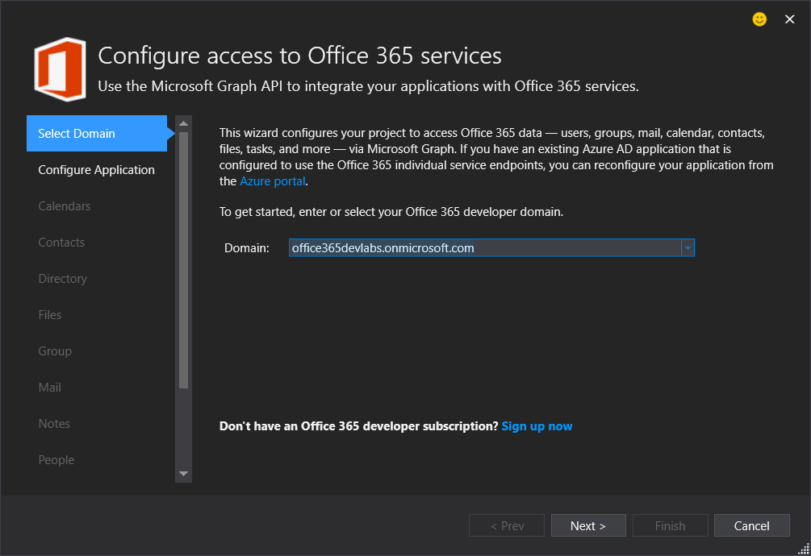

点击“Next”进行Application的配置，如果是第一次操作，则选择“Create a new Azure AD Application”
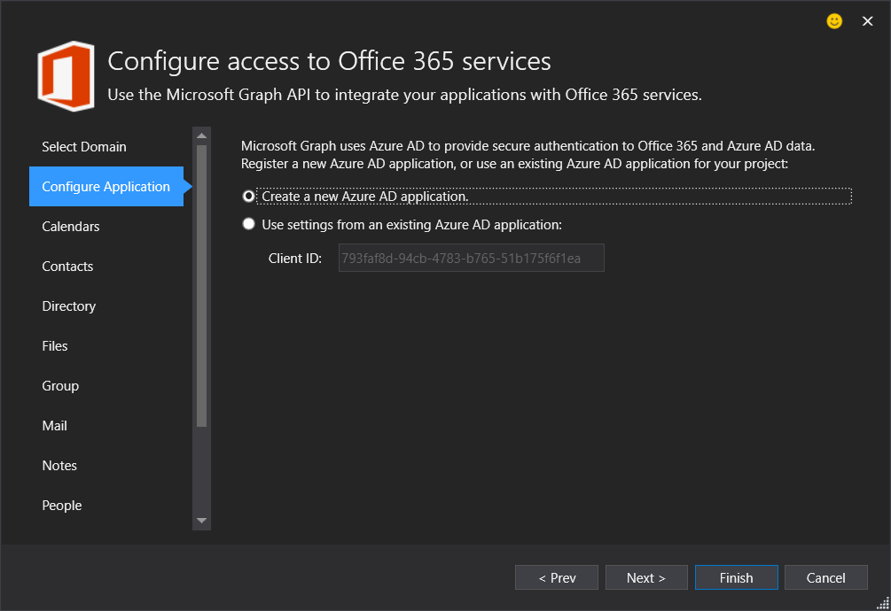

接下来，按照文档要求， 选择以下几个权限
```
For the File APIs, set permissions to Have full access to your files
For the Mail APIs, set permissions to Send mail as you
For the User APIs, set permissions to Sign you in and read your profile
```

最后，按照文档要求，将Models目录下面的GraphService.cs文件中的几行代码取消注释。一切就绪，我们就可以调试了。


点击右上角的“Sign in with Microsoft”，会被导航到Office 365的登录页面
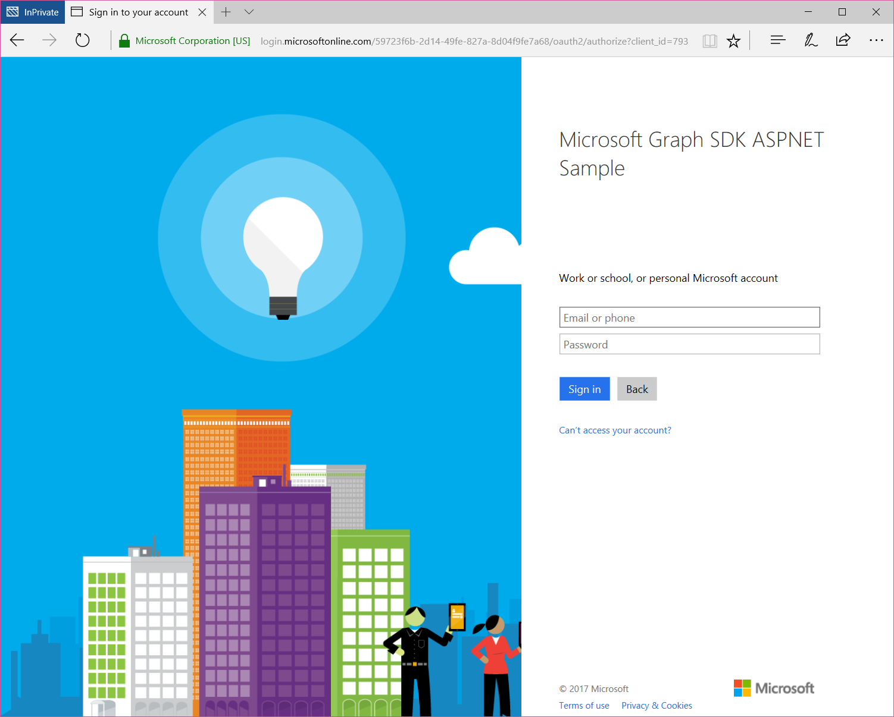

输入用户名和密码后，点击“Sign In”，系统会引导你对权限进行确认
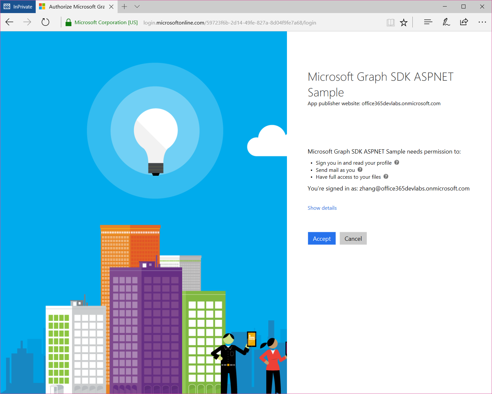

点击“Accept”后回到主界面，然后点击“Get email address” 按钮可以看到读取到当前用户的邮箱地址，然后点击“send mail”则可以实现邮件发送。
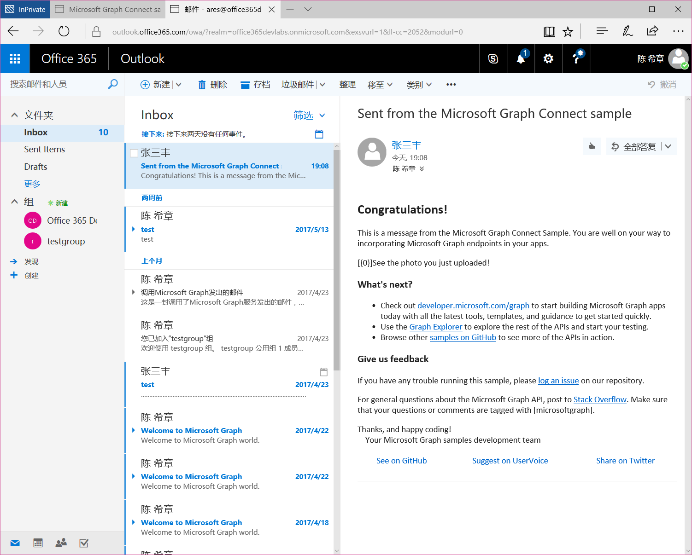

看起来还是不错的，对吧？那么，这是怎么做到的呢？首先是Visual Studio帮我们做了不少工作，主要是自动完成应用程序注册，并且在配置文件中保存信息
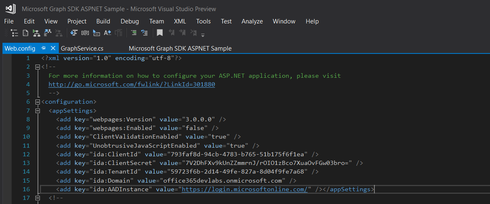

其次，这个范例程序，里面有几个文件预先编写好了代码

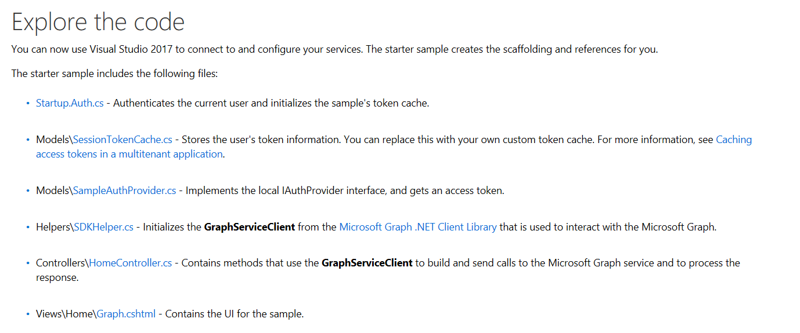

我不想解释这些代码。我当然是知道为什么应该这么写，但并不想让每个人都去这么写。作为一个有一点追求的老同志，我根据这些代码的逻辑封装了一个组件，便于在大家后续开发的时候，直接使用。


## 在你的应用中快速集成Microsoft Graph

范例运行成功并没有什么了不起，下面就要看一下怎么在一个自己写的应用程序中实现同样的功能。我上面提到了，虽然Visual Studio帮我们做了不少工作，但有些代码还是省不了的，为了让大家的代码减到最少，我写了一个组件，叫做Office365GraphMVCHelper。


接下来我就带大家来极致体验一下，怎么用不到三行代码就完整地实现Microsoft Graph的调用。对，就是这么任性。

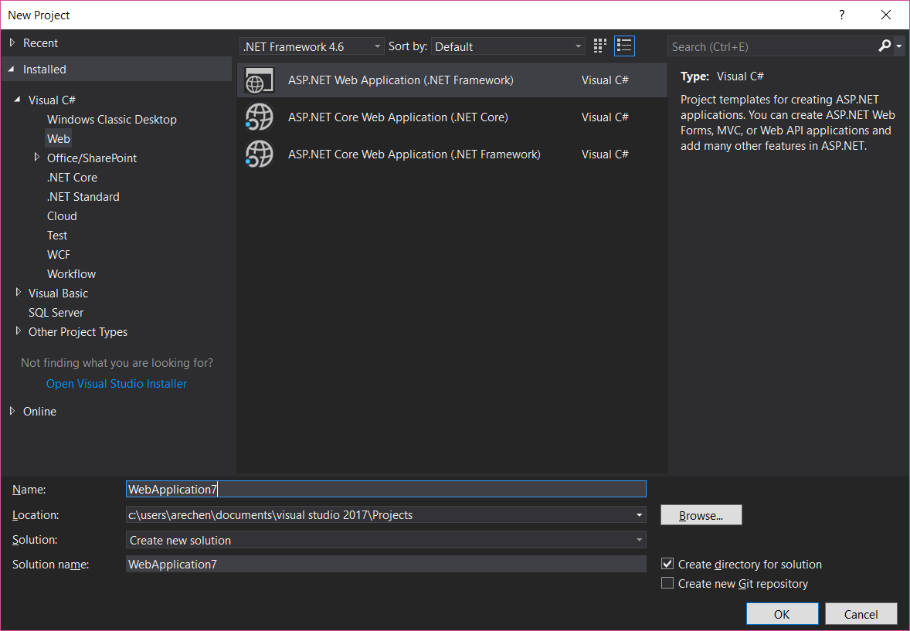

请注意使用Visual Studio 2017 Preview，同时确保上面对话框中，目标的Framework选择 4.6。然后再下面的对话框中选择“Empty”模板，并选择“MVC”这个功能

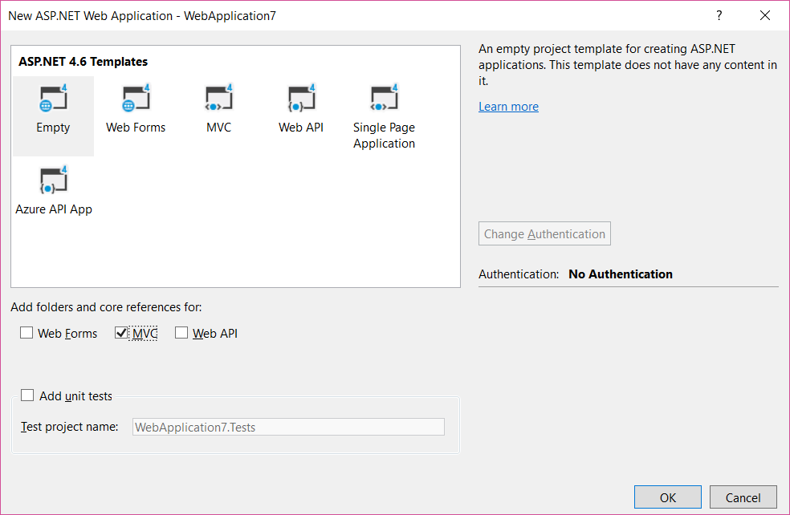

按照之前的介绍，添加"Connected Service","Access Office 365 Services with Microsoft Graph"。作为演示目的，请选择一个权限即可

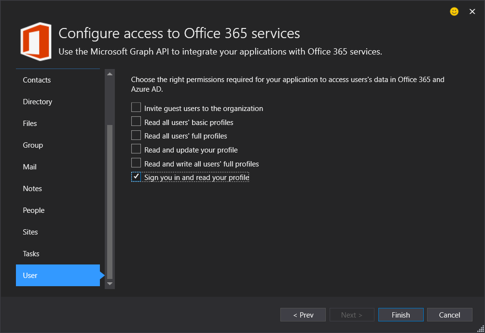

接下来就是添加我写好的那个组件，请运行下面的命令
Install-Package Office365GraphMVCHelper

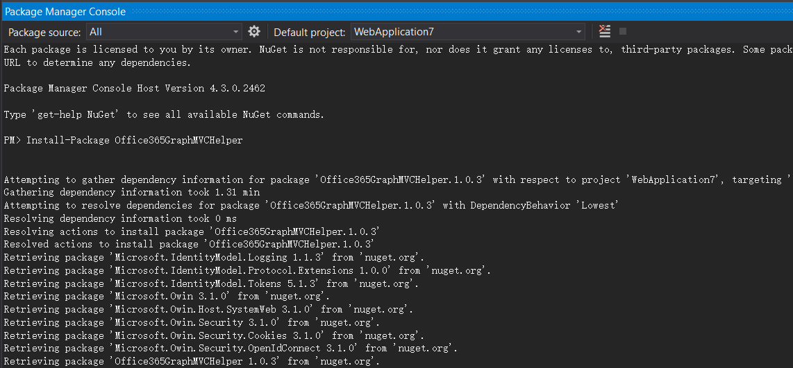

接下来为当前这个项目添加一个启动类（Owin Startup Class）


用一行代码为启动类添加Microsoft Graph身份功能
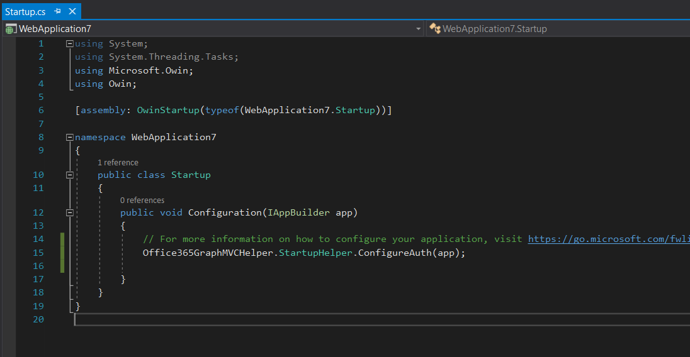

接下来就可以实现业务模块了，我们可以添加一个默认的Controller，在Index这个Action里面，我用两行代码做了实现：读取当前用户的信息，并且输出到浏览器。
> 请不要告诉你不知道什么叫Controller，咱这篇文章讲的是MVC哦

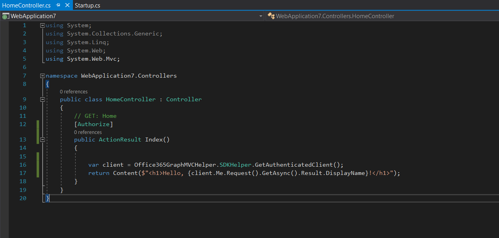

运行起来看看效果吧。在要求你输入用户名和密码，以及授权确认后，你将看到如下的界面。
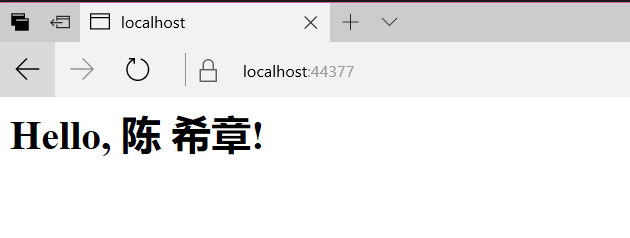

当然，这只是一个演示，但只要打开了这扇大门，接下来你要做的就是尽情地调用Microsoft Graph所提供的功能了，详情请参考 <https://github.com/microsoftgraph/msgraph-sdk-dotnet> 。

## 总结
这一篇文章讲解了Visual Studio 2017 Preview最新推出的直接将Microsoft Graph集成到应用程序的开发体验，并且演示了如何借助我封装好的一个组件，进一步将后续编码简化到最少。我后续还会看看怎么把中国版的功能整合进来。

